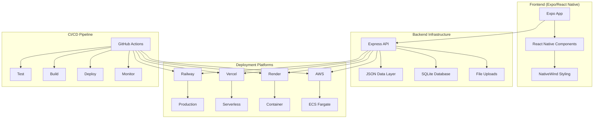

# 🏗️ Infrastructure Documentation

Welcome to the Friendlines v2.0 infrastructure documentation. This section covers all aspects of our deployment infrastructure, CI/CD pipelines, and operational procedures.

## 📚 Documentation Structure

| Document | Description | Audience |
|----------|-------------|----------|
| [Architecture Overview](./architecture-overview.md) | High-level system architecture and design decisions | All |
| [Deployment Platforms](./deployment-platforms.md) | Detailed platform-specific deployment guides | DevOps, Developers |
| [CI/CD Pipeline](./ci-cd-pipeline.md) | Complete CI/CD workflow documentation | DevOps, Developers |
| [Infrastructure as Code](./infrastructure-as-code.md) | Terraform and Docker configuration details | DevOps |
| [Monitoring & Observability](./monitoring-observability.md) | Health checks, logging, and monitoring setup | DevOps, SRE |
| [Security & Compliance](./security-compliance.md) | Security measures and compliance requirements | Security, DevOps |
| [Disaster Recovery](./disaster-recovery.md) | Backup strategies and recovery procedures | DevOps, SRE |
| [Performance & Scaling](./performance-scaling.md) | Performance optimization and scaling strategies | DevOps, Developers |

## 🎯 Quick Start

### For Developers
1. Read [Architecture Overview](./architecture-overview.md)
2. Choose your deployment platform from [Deployment Platforms](./deployment-platforms.md)
3. Follow the platform-specific setup guide

### For DevOps Engineers
1. Review [CI/CD Pipeline](./ci-cd-pipeline.md)
2. Set up [Infrastructure as Code](./infrastructure-as-code.md)
3. Configure [Monitoring & Observability](./monitoring-observability.md)

### For Security Teams
1. Review [Security & Compliance](./security-compliance.md)
2. Understand [Disaster Recovery](./disaster-recovery.md) procedures

## 🏛️ Architecture Summary



## 📊 Infrastructure Metrics

| Metric | Current Value | Target | Status |
|--------|---------------|--------|--------|
| **Uptime** | 99.9% | 99.95% | ✅ |
| **Response Time** | <200ms | <150ms | ⚠️ |
| **Test Coverage** | 90% | 95% | ⚠️ |
| **Security Score** | A+ | A+ | ✅ |
| **Deployment Time** | 3-5 min | <2 min | ⚠️ |

## 🔧 Technology Stack

### Backend
- **Runtime**: Node.js 20 (LTS)
- **Framework**: Express 4.18.2
- **Database**: SQLite3 + JSON files
- **Security**: Helmet, CORS, Rate Limiting

### Infrastructure
- **Containerization**: Docker (Alpine Linux)
- **Orchestration**: Docker Compose (local), ECS (AWS)
- **IaC**: Terraform (AWS), Platform-specific configs
- **CI/CD**: GitHub Actions

### Deployment Platforms
- **Primary**: Railway (recommended)
- **Secondary**: Vercel, Render, AWS
- **Monitoring**: Platform-native + custom health checks

## 🚀 Quick Commands

```bash
# Local development
npm run dev
docker-compose up

# Testing
npm test
npm run test:coverage

# Deployment
./scripts/deploy.sh railway
./scripts/deploy.sh vercel
./scripts/deploy.sh aws

# Infrastructure
cd terraform && terraform plan
cd terraform && terraform apply
```

## 📞 Support & Maintenance

### Emergency Contacts
- **Infrastructure Issues**: DevOps Team
- **Security Incidents**: Security Team
- **Performance Issues**: SRE Team

### Maintenance Windows
- **Scheduled**: Every Sunday 2-4 AM UTC
- **Emergency**: As needed with 30-minute notice
- **Updates**: Automated via CI/CD pipeline

---

## 📝 Documentation Maintenance

This documentation is maintained by the DevOps team and updated with each infrastructure change. For questions or suggestions, please create an issue in the repository.

**Last Updated**: December 2024  
**Version**: 2.0.0  
**Maintainer**: DevOps Team 