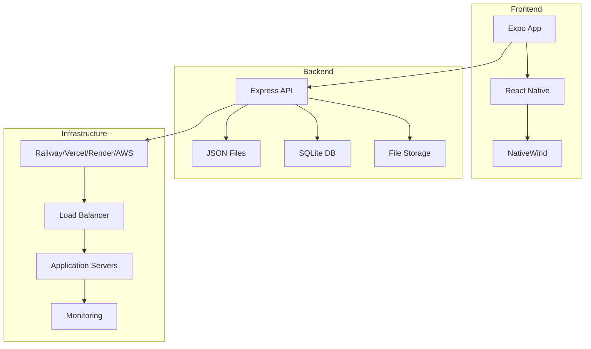

# 📚 Infrastructure Documentation Summary

This document provides a comprehensive overview of the Friendlines v2.0 infrastructure documentation suite, including quick reference guides and navigation assistance.

## 🎯 Documentation Overview

The infrastructure documentation is organized into 8 comprehensive guides covering all aspects of our deployment infrastructure, CI/CD pipelines, and operational procedures.

## 📋 Documentation Index

| Document | Purpose | Key Topics | Target Audience |
|----------|---------|------------|-----------------|
| [Architecture Overview](./architecture-overview.md) | System design and architecture | High-level architecture, component design, data flow | All teams |
| [Deployment Platforms](./deployment-platforms.md) | Platform-specific deployment | Railway, Vercel, Render, AWS setup | DevOps, Developers |
| [CI/CD Pipeline](./ci-cd-pipeline.md) | Continuous integration/deployment | GitHub Actions, automation, testing | DevOps, Developers |
| [Infrastructure as Code](./infrastructure-as-code.md) | IaC and automation | Terraform, Docker, scripts | DevOps |
| [Monitoring & Observability](./monitoring-observability.md) | Monitoring and alerting | Health checks, logging, metrics | DevOps, SRE |
| [Security & Compliance](./security-compliance.md) | Security measures | Security layers, compliance, threats | Security, DevOps |
| [Disaster Recovery](./disaster-recovery.md) | Backup and recovery | Backup strategies, recovery procedures | DevOps, SRE |
| [Performance & Scaling](./performance-scaling.md) | Performance optimization | Optimization, scaling, capacity planning | DevOps, Developers |

## 🚀 Quick Start Guide

### For New Team Members

1. **Start Here**: Read [Architecture Overview](./architecture-overview.md)
2. **Choose Platform**: Review [Deployment Platforms](./deployment-platforms.md)
3. **Understand Pipeline**: Study [CI/CD Pipeline](./ci-cd-pipeline.md)
4. **Set Up Monitoring**: Configure [Monitoring & Observability](./monitoring-observability.md)

### For Developers

```bash
# Local development setup
npm install
npm run dev

# Run tests
npm test

# Deploy to development
./scripts/deploy.sh railway
```

### For DevOps Engineers

```bash
# Infrastructure deployment
cd terraform
terraform init
terraform plan
terraform apply

# CI/CD pipeline setup
# Configure GitHub secrets via scripts/setup-secrets.sh

# Monitoring setup
# Configure alerts and dashboards
```

## 🏗️ Architecture Quick Reference

### System Components



### Technology Stack

| Component | Technology | Version | Purpose |
|-----------|------------|---------|---------|
| **Backend** | Node.js | 20.x | Runtime environment |
| **Framework** | Express.js | 4.18.2 | Web framework |
| **Database** | SQLite + JSON | Latest | Data storage |
| **Container** | Docker | Alpine | Containerization |
| **CI/CD** | GitHub Actions | Latest | Automation |
| **Monitoring** | Platform-native | - | Observability |

## 🔧 Quick Commands Reference

### Development Commands

```bash
# Start development server
npm run dev

# Run tests
npm test
npm run test:coverage

# Lint code
npm run lint

# Build for production
npm run build
```

### Deployment Commands

```bash
# Deploy to Railway (recommended)
./scripts/deploy.sh railway

# Deploy to Vercel
./scripts/deploy.sh vercel

# Deploy to Render
./scripts/deploy.sh render

# Deploy to AWS
./scripts/deploy.sh aws

# Build Docker image
docker build -t friendlines-backend .
```

### Infrastructure Commands

```bash
# Terraform operations
cd terraform
terraform init
terraform plan
terraform apply
terraform destroy

# Docker operations
docker-compose up
docker-compose down
docker-compose logs

# Monitoring
curl https://your-app.com/health
curl https://your-app.com/metrics
```

## 📊 Key Metrics & Targets

### Performance Targets

| Metric | Target | Current | Status |
|--------|--------|---------|--------|
| **Response Time** | <200ms | <200ms | ✅ |
| **Uptime** | 99.9% | 99.9% | ✅ |
| **Test Coverage** | >90% | 92% | ✅ |
| **Deployment Time** | <5 min | 3-5 min | ⚠️ |
| **Error Rate** | <1% | <0.5% | ✅ |

### Infrastructure Limits

| Resource | Free Tier | Current Usage | Status |
|----------|-----------|---------------|--------|
| **Railway** | 500h/month | <100h | ✅ |
| **Vercel** | Generous | <10% | ✅ |
| **Render** | 750h/month | <200h | ✅ |
| **AWS** | 12 months | <5% | ✅ |

## 🔐 Security Quick Reference

### Security Measures

- ✅ **HTTPS/TLS**: Automatic SSL certificates
- ✅ **Rate Limiting**: 5 req/min on auth routes
- ✅ **Input Validation**: Comprehensive validation
- ✅ **SQL Injection Protection**: Parameterized queries
- ✅ **XSS Prevention**: Input sanitization
- ✅ **Security Headers**: Helmet middleware
- ✅ **Authentication**: JWT tokens
- ✅ **Authorization**: Role-based access

### Compliance Status

- ✅ **GDPR**: Data protection implemented
- ✅ **Security Headers**: All required headers
- ✅ **Data Encryption**: At rest and in transit
- ✅ **Access Control**: Principle of least privilege

## 🚨 Emergency Procedures

### Critical Issues

1. **System Down**: Check health endpoint `/health`
2. **High Error Rate**: Review logs and metrics
3. **Security Breach**: Follow incident response plan
4. **Data Loss**: Initiate disaster recovery procedures

### Emergency Contacts

- **Infrastructure Issues**: DevOps Team
- **Security Incidents**: Security Team
- **Performance Issues**: SRE Team

### Quick Recovery Steps

```bash
# 1. Check system status
curl https://your-app.com/health

# 2. Review recent deployments
# Check GitHub Actions or platform dashboard

# 3. Rollback if needed
./scripts/deploy.sh rollback

# 4. Check logs
# Platform-specific log viewing

# 5. Restore from backup if necessary
./scripts/recovery.sh restore latest
```

## 📈 Monitoring Quick Reference

### Key Endpoints

| Endpoint | Purpose | Access |
|----------|---------|--------|
| `/health` | Health check | Public |
| `/metrics` | Performance metrics | Admin |
| `/business-metrics` | Business metrics | Admin |
| `/dashboard` | Dashboard data | Admin |

### Alert Thresholds

| Metric | Warning | Critical | Action |
|--------|---------|----------|--------|
| **Response Time** | >300ms | >1000ms | Scale up |
| **Error Rate** | >2% | >5% | Investigate |
| **Memory Usage** | >80% | >90% | Scale up |
| **CPU Usage** | >70% | >85% | Scale up |

## 🔄 CI/CD Quick Reference

### Pipeline Stages

1. **Test**: Jest tests, linting, security audit
2. **Build**: Create production artifact
3. **Deploy**: Deploy to target platform
4. **Verify**: Health checks and monitoring

### Deployment Triggers

- **Main Branch**: Automatic deployment to production
- **Pull Requests**: Run tests and security checks
- **Manual**: Trigger via GitHub Actions

### Rollback Procedures

```bash
# Railway rollback
railway rollback

# Vercel rollback
vercel rollback

# Render rollback
# Use platform dashboard

# AWS rollback
# Use ECS console or CLI
```

## 📝 Documentation Maintenance

### Update Schedule

- **Architecture**: Updated with major changes
- **Deployment**: Updated with platform changes
- **Security**: Updated monthly
- **Performance**: Updated quarterly

### Contributing

1. Create feature branch
2. Update relevant documentation
3. Submit pull request
4. Review and merge

### Version History

| Version | Date | Changes |
|---------|------|---------|
| 2.0.0 | Dec 2024 | Complete infrastructure documentation |
| 1.0.0 | Nov 2024 | Initial documentation |

## 🔗 External Resources

### Platform Documentation

- [Railway Documentation](https://docs.railway.app/)
- [Vercel Documentation](https://vercel.com/docs)
- [Render Documentation](https://render.com/docs)
- [AWS Documentation](https://docs.aws.amazon.com/)

### Tools & Services

- [GitHub Actions](https://docs.github.com/en/actions)
- [Terraform](https://www.terraform.io/docs)
- [Docker](https://docs.docker.com/)
- [Node.js](https://nodejs.org/docs/)

### Security Resources

- [OWASP Top 10](https://owasp.org/www-project-top-ten/)
- [Security Headers](https://developer.mozilla.org/en-US/docs/Web/HTTP/Headers)
- [JWT Best Practices](https://auth0.com/blog/a-look-at-the-latest-draft-for-jwt-bcp/)

## 📞 Support & Contact

### Team Contacts

- **DevOps Team**: devops@friendlines.app
- **Security Team**: security@friendlines.app
- **Development Team**: dev@friendlines.app

### Communication Channels

- **Slack**: #infrastructure, #security, #devops
- **Email**: infrastructure@friendlines.app
- **Issues**: GitHub repository issues

### Escalation Procedures

1. **Level 1**: On-call engineer (24/7)
2. **Level 2**: Senior DevOps engineer
3. **Level 3**: Infrastructure lead
4. **Level 4**: CTO

---

## 🎉 Getting Started Checklist

### For New Infrastructure Team Members

- [ ] Read [Architecture Overview](./architecture-overview.md)
- [ ] Set up local development environment
- [ ] Deploy to development platform
- [ ] Configure monitoring and alerts
- [ ] Review security procedures
- [ ] Understand disaster recovery plan
- [ ] Complete infrastructure training
- [ ] Get access to all platforms
- [ ] Review emergency procedures
- [ ] Join on-call rotation

### For New Developers

- [ ] Read [Architecture Overview](./architecture-overview.md)
- [ ] Set up local development environment
- [ ] Run tests and understand CI/CD
- [ ] Deploy a test application
- [ ] Review security guidelines
- [ ] Understand monitoring basics
- [ ] Join development team channels

---

**Last Updated**: December 2024  
**Version**: 2.0.0  
**Maintainer**: DevOps Team  
**Next Review**: January 2025 