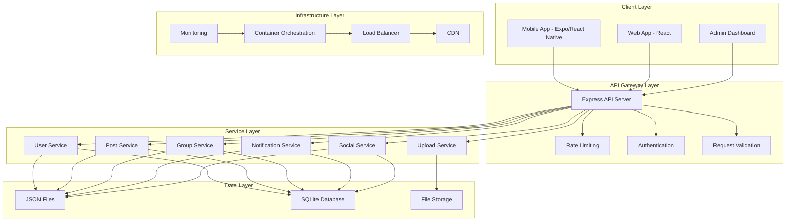
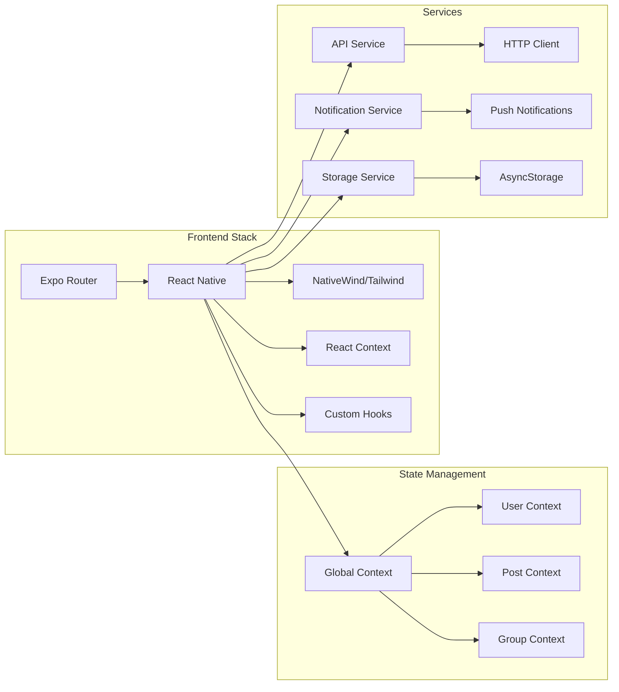
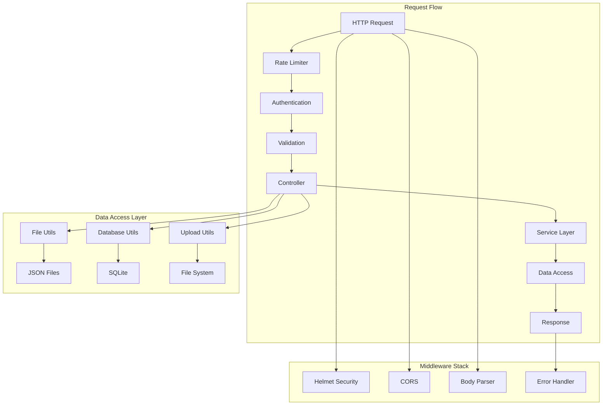
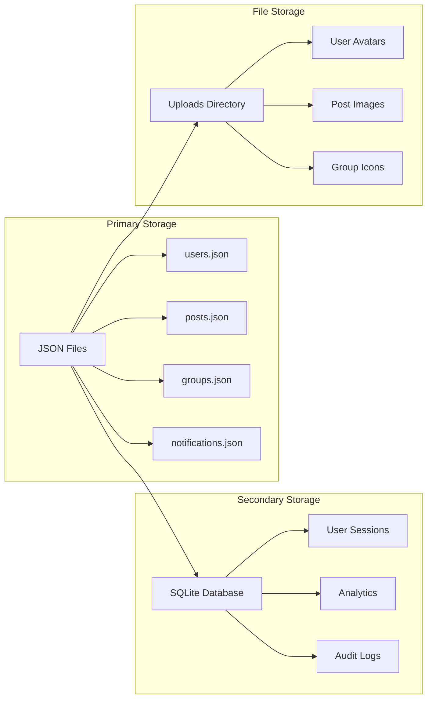
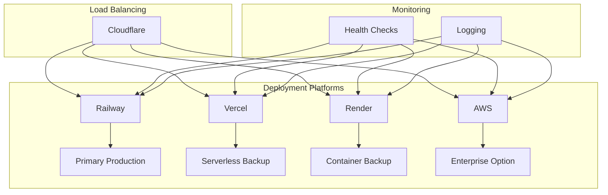
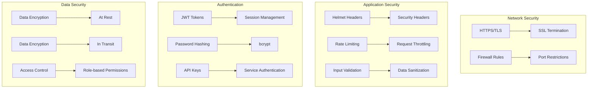
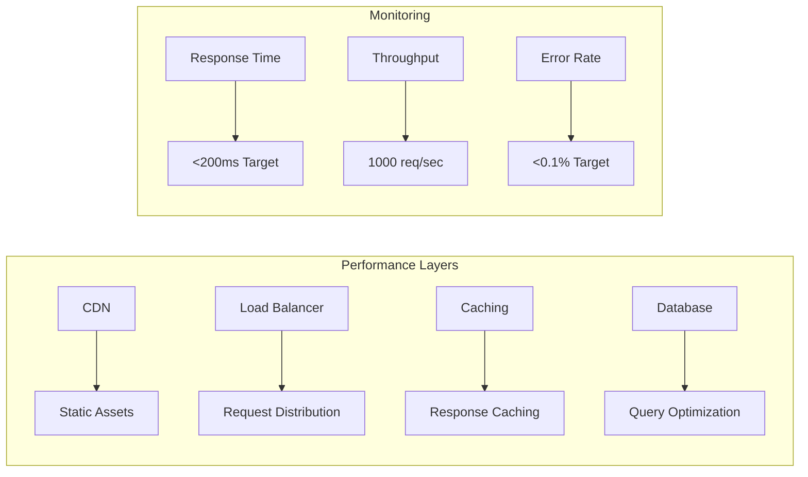

# 🏛️ Architecture Overview

This document provides a comprehensive overview of the Friendlines v2.0 system architecture, including design decisions, component interactions, and infrastructure patterns.

## 🎯 System Overview

Friendlines v2.0 is a modern social news application built with a microservices-inspired architecture, featuring a React Native frontend and a Node.js backend API. The system is designed for high availability, scalability, and maintainability.

## 🏗️ High-Level Architecture



## 🧩 Component Architecture

### 1. Frontend Architecture (Expo/React Native)



### 2. Backend Architecture (Node.js/Express)



## 📊 Data Architecture

### Data Storage Strategy



### Data Flow Patterns

| Pattern | Use Case | Implementation |
|---------|----------|----------------|
| **CRUD Operations** | User management, posts, groups | JSON file operations via `fileUtils.js` |
| **Session Management** | User authentication | SQLite with session tokens |
| **File Uploads** | Images, documents | Multer middleware + file system |
| **Caching** | Frequently accessed data | In-memory caching (planned) |
| **Backup** | Data protection | Git-based versioning + automated backups |

## 🔄 API Architecture

### RESTful Endpoint Structure

```mermaid
graph TB
    subgraph "API Endpoints"
        A[/api] --> B[/auth]
        A --> C[/users]
        A --> D[/posts]
        A --> E[/groups]
        A --> F[/social]
        A --> G[/notifications]
        A --> H[/upload]
    end
    
    subgraph "Authentication"
        B --> I[POST /login]
        B --> J[POST /register]
        B --> K[POST /logout]
        B --> L[GET /profile]
    end
    
    subgraph "User Management"
        C --> M[GET /users]
        C --> N[GET /users/:id]
        C --> O[PUT /users/:id]
        C --> P[DELETE /users/:id]
    end
    
    subgraph "Content Management"
        D --> Q[GET /posts]
        D --> R[POST /posts]
        D --> S[PUT /posts/:id]
        D --> T[DELETE /posts/:id]
    end
```

### Response Format Standardization

```json
{
  "success": true,
  "data": {
    // Response data
  },
  "message": "Operation completed successfully",
  "timestamp": "2024-12-17T10:30:00Z",
  "requestId": "req_123456789"
}
```

## 🏢 Infrastructure Patterns

### Multi-Platform Deployment



### Container Architecture

```mermaid
graph TB
    subgraph "Docker Layers"
        A[Alpine Linux Base] --> B[Node.js 20 Runtime]
        B --> C[Application Code]
        C --> D[Production Dependencies]
        D --> E[Security Hardening]
    end
    
    subgraph "Container Security"
        F[Non-root User] --> G[nodejs:1001]
        H[dumb-init] --> I[Signal Handling]
        J[Health Checks] --> K[/health Endpoint]
    end
    
    subgraph "Volume Mounts"
        L[Data Directory] --> M[/app/data]
        N[Uploads Directory] --> O[/app/uploads]
        P[Logs Directory] --> Q[/app/logs]
    end
```

## 🔐 Security Architecture

### Security Layers



## 📈 Scalability Patterns

### Horizontal Scaling Strategy

| Component | Scaling Method | Trigger | Implementation |
|-----------|----------------|---------|----------------|
| **API Servers** | Auto-scaling groups | CPU/Memory usage | Platform-native scaling |
| **Database** | Read replicas | Read-heavy workloads | SQLite → PostgreSQL migration |
| **File Storage** | CDN distribution | Global access | Cloudflare CDN |
| **Caching** | Redis clusters | High-frequency requests | In-memory → Redis migration |

### Performance Optimization



## 🎯 Design Principles

### 1. **Simplicity First**
- Minimal dependencies
- Clear separation of concerns
- Easy to understand and maintain

### 2. **Platform Agnostic**
- Multiple deployment options
- No vendor lock-in
- Easy migration between platforms

### 3. **Security by Design**
- Defense in depth
- Principle of least privilege
- Regular security audits

### 4. **Observability**
- Comprehensive logging
- Health checks
- Performance monitoring

### 5. **Disaster Recovery**
- Automated backups
- Multi-region deployment
- Quick recovery procedures

## 🔄 Evolution Roadmap

### Phase 1: Current State ✅
- JSON file-based storage
- Single-region deployment
- Basic monitoring

### Phase 2: Enhanced (Q1 2025)
- SQLite database migration
- Multi-region deployment
- Advanced monitoring

### Phase 3: Enterprise (Q2 2025)
- PostgreSQL database
- Microservices architecture
- Advanced security features

### Phase 4: Scale (Q3 2025)
- Kubernetes orchestration
- Service mesh
- Advanced analytics

---

## 📝 Architecture Decisions

| Decision | Rationale | Alternatives Considered |
|----------|-----------|-------------------------|
| **JSON Files for Data** | Simplicity, easy backup | PostgreSQL, MongoDB |
| **Express.js Framework** | Mature, well-documented | Fastify, Koa |
| **Docker Containerization** | Consistency, portability | Direct deployment |
| **Multi-platform Deployment** | Redundancy, cost optimization | Single platform |

## 🔗 Related Documentation

- [Deployment Platforms](./deployment-platforms.md)
- [CI/CD Pipeline](./ci-cd-pipeline.md)
- [Security & Compliance](./security-compliance.md)
- [Performance & Scaling](./performance-scaling.md)

---

**Last Updated**: December 2024  
**Version**: 2.0.0  
**Architect**: DevOps Team 