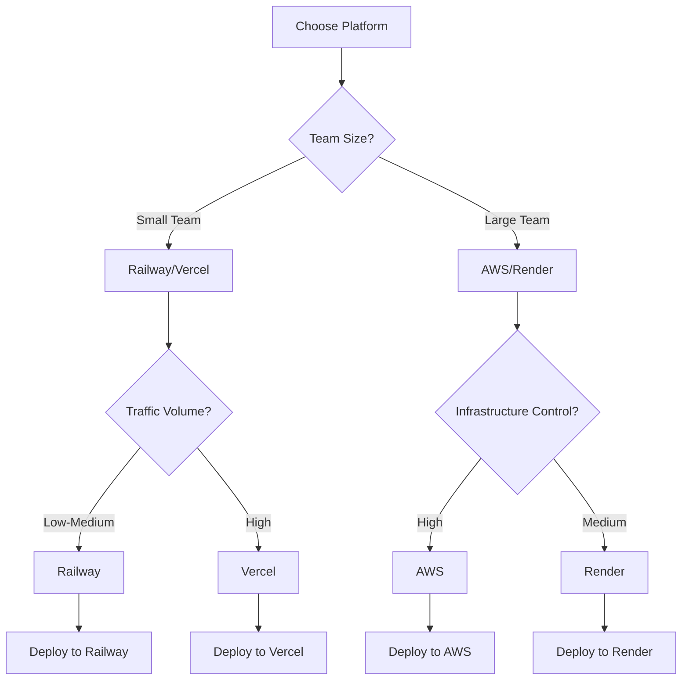
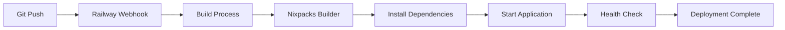
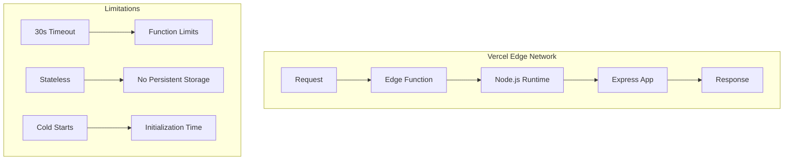
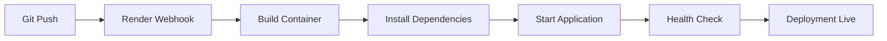
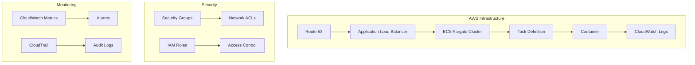

# 🚀 Deployment Platforms

This document provides detailed information about all supported deployment platforms for Friendlines v2.0, including setup guides, configuration files, and platform-specific considerations.

## 📊 Platform Comparison

| Platform | Free Tier | Ease of Use | Features | Best For | Setup Time |
|----------|-----------|-------------|----------|----------|------------|
| **Railway** ⭐ | 500h/month | Very Easy | Auto-deploy, monitoring | Node.js apps | 5 min |
| **Vercel** | Generous limits | Easy | Serverless, CDN | Stateless APIs | 3 min |
| **Render** | 750h/month | Easy | Simple setup | Basic deployments | 7 min |
| **AWS** | 12 months | Complex | Full control | Enterprise/Learning | 30 min |

## 🎯 Platform Selection Guide



## 🚂 Railway (Recommended)

### Overview
Railway is our primary deployment platform, offering excellent Node.js support, automatic deployments, and comprehensive monitoring.

### Features
- ✅ **Free Tier**: 500 hours/month
- ✅ **Auto-deploy**: Git-based deployments
- ✅ **HTTPS**: Automatic SSL certificates
- ✅ **Monitoring**: Built-in metrics and logs
- ✅ **Environment Variables**: Secure secret management
- ✅ **Custom Domains**: Easy domain configuration

### Configuration Files

#### `railway.toml`
```toml
[build]
builder = "nixpacks"

[deploy]
startCommand = "npm start"
healthcheckPath = "/health"
healthcheckTimeout = 300

[[deploy.environmentVariables]]
name = "NODE_ENV"
value = "production"

[[deploy.environmentVariables]]
name = "PORT"
value = "3000"

[environments.production]
variables = { NODE_ENV = "production" }

[environments.staging]
variables = { NODE_ENV = "staging" }
```

#### `nixpacks.toml`
```toml
[providers]
node = "20"

[variables]
NODE_ENV = "production"

[phases.setup]
nixPkgs = ["nodejs_20", "npm"]

[phases.install]
cmds = ["npm ci --production"]

[phases.build]
cmds = ["echo 'No build step required for Node.js API'"]

[start]
cmd = "npm start"
```

### Setup Guide

#### 1. Install Railway CLI
```bash
npm install -g @railway/cli
```

#### 2. Login to Railway
```bash
railway login
```

#### 3. Initialize Project
```bash
railway init
```

#### 4. Deploy
```bash
railway up
```

#### 5. Configure Environment Variables
```bash
railway variables set NODE_ENV=production
railway variables set PORT=3000
```

### Deployment Flow



### Monitoring & Logs

```bash
# View logs
railway logs

# View metrics
railway metrics

# Check status
railway status
```

## ⚡ Vercel (Serverless)

### Overview
Vercel provides serverless deployment with global CDN and excellent performance for stateless applications.

### Features
- ✅ **Free Tier**: Generous limits
- ✅ **Global CDN**: Edge network
- ✅ **Serverless**: Auto-scaling
- ✅ **HTTPS**: Automatic SSL
- ✅ **Preview Deployments**: PR-based previews
- ⚠️ **Limitations**: 30s function timeout, stateless only

### Configuration Files

#### `vercel.json`
```json
{
  "version": 2,
  "name": "friendlines-backend",
  "builds": [
    {
      "src": "server.js",
      "use": "@vercel/node",
      "config": {
        "includeFiles": [
          "controllers/**",
          "middleware/**",
          "routes/**",
          "utils/**",
          "data/**"
        ]
      }
    }
  ],
  "routes": [
    {
      "src": "/health",
      "dest": "/server.js"
    },
    {
      "src": "/api/(.*)",
      "dest": "/server.js"
    },
    {
      "src": "/uploads/(.*)",
      "dest": "/server.js"
    },
    {
      "src": "/",
      "dest": "/server.js"
    }
  ],
  "env": {
    "NODE_ENV": "production"
  },
  "functions": {
    "server.js": {
      "maxDuration": 30
    }
  },
  "headers": [
    {
      "source": "/api/(.*)",
      "headers": [
        {
          "key": "Access-Control-Allow-Origin",
          "value": "*"
        },
        {
          "key": "Access-Control-Allow-Methods",
          "value": "GET, POST, PUT, DELETE, OPTIONS"
        },
        {
          "key": "Access-Control-Allow-Headers",
          "value": "Content-Type, Authorization, X-Requested-With"
        }
      ]
    }
  ]
}
```

### Setup Guide

#### 1. Install Vercel CLI
```bash
npm install -g vercel
```

#### 2. Login to Vercel
```bash
vercel login
```

#### 3. Deploy
```bash
vercel --prod
```

#### 4. Configure Environment Variables
```bash
vercel env add NODE_ENV production
vercel env add PORT 3000
```

### Serverless Architecture



## 🐳 Render (Container)

### Overview
Render provides simple container deployment with automatic scaling and built-in SSL.

### Features
- ✅ **Free Tier**: 750 hours/month
- ✅ **Container Support**: Docker-based deployment
- ✅ **Auto-deploy**: Git integration
- ✅ **SSL**: Built-in HTTPS
- ⚠️ **Limitations**: Spins down when idle

### Configuration Files

#### `render.yaml`
```yaml
services:
  - type: web
    name: friendlines-backend
    env: node
    region: oregon
    plan: free
    buildCommand: npm ci
    startCommand: npm start
    healthCheckPath: /health
    envVars:
      - key: NODE_ENV
        value: production
      - key: PORT
        fromService:
          type: web
          name: friendlines-backend
          property: port
    autoDeploy: false
```

### Setup Guide

#### 1. Connect GitHub Repository
1. Go to [Render Dashboard](https://dashboard.render.com)
2. Click "New +" → "Web Service"
3. Connect your GitHub repository

#### 2. Configure Service
- **Name**: `friendlines-backend`
- **Environment**: `Node`
- **Build Command**: `npm ci`
- **Start Command**: `npm start`
- **Health Check Path**: `/health`

#### 3. Set Environment Variables
```bash
NODE_ENV=production
PORT=3000
```

### Container Deployment Flow



## ☁️ AWS (Enterprise)

### Overview
AWS provides full infrastructure control with advanced features for enterprise deployments.

### Features
- ✅ **Free Tier**: 12 months
- ✅ **Full Control**: Complete infrastructure management
- ✅ **Scalability**: Auto-scaling groups
- ✅ **Security**: Advanced security features
- ⚠️ **Complexity**: Steep learning curve

### Infrastructure as Code

#### Terraform Configuration

##### `terraform/main.tf`
```hcl
# AWS Free Tier deployment for Friendlines Backend
terraform {
  required_version = ">= 1.0"
  
  required_providers {
    aws = {
      source  = "hashicorp/aws"
      version = "~> 5.0"
    }
  }
}

# Configure AWS Provider
provider "aws" {
  region = var.aws_region
  
  default_tags {
    tags = {
      Project     = "Friendlines"
      Environment = var.environment
      ManagedBy   = "Terraform"
    }
  }
}

# VPC Configuration
resource "aws_vpc" "main" {
  cidr_block           = var.vpc_cidr
  enable_dns_hostnames = true
  enable_dns_support   = true
  
  tags = {
    Name = "${var.project_name}-vpc"
  }
}

# ECS Cluster
resource "aws_ecs_cluster" "main" {
  name = "${var.project_name}-cluster"
  
  setting {
    name  = "containerInsights"
    value = "enabled"
  }
  
  tags = {
    Name = "${var.project_name}-cluster"
  }
}

# ECS Task Definition
resource "aws_ecs_task_definition" "app" {
  family                   = "${var.project_name}-task"
  network_mode             = "awsvpc"
  requires_compatibilities = ["FARGATE"]
  cpu                      = var.task_cpu
  memory                   = var.task_memory
  execution_role_arn       = aws_iam_role.ecs_execution_role.arn
  task_role_arn            = aws_iam_role.ecs_task_role.arn
  
  container_definitions = jsonencode([
    {
      name  = "${var.project_name}-container"
      image = "${aws_ecr_repository.app.repository_url}:latest"
      
      portMappings = [
        {
          containerPort = 3000
          protocol      = "tcp"
        }
      ]
      
      environment = [
        {
          name  = "NODE_ENV"
          value = "production"
        },
        {
          name  = "PORT"
          value = "3000"
        }
      ]
      
      logConfiguration = {
        logDriver = "awslogs"
        options = {
          awslogs-group         = aws_cloudwatch_log_group.app.name
          awslogs-region        = var.aws_region
          awslogs-stream-prefix = "ecs"
        }
      }
      
      healthCheck = {
        command     = ["CMD-SHELL", "curl -f http://localhost:3000/health || exit 1"]
        interval    = 30
        timeout     = 5
        retries     = 3
        startPeriod = 60
      }
    }
  ])
  
  tags = {
    Name = "${var.project_name}-task-definition"
  }
}
```

### Setup Guide

#### 1. Install Prerequisites
```bash
# Install AWS CLI
curl "https://awscli.amazonaws.com/awscli-exe-linux-x86_64.zip" -o "awscliv2.zip"
unzip awscliv2.zip
sudo ./aws/install

# Install Terraform
curl -fsSL https://apt.releases.hashicorp.com/gpg | sudo apt-key add -
sudo apt-add-repository "deb [arch=amd64] https://apt.releases.hashicorp.com $(lsb_release -cs) main"
sudo apt-get update && sudo apt-get install terraform

# Install Docker
sudo apt-get install docker.io
sudo usermod -aG docker $USER
```

#### 2. Configure AWS Credentials
```bash
aws configure
# Enter your AWS Access Key ID
# Enter your AWS Secret Access Key
# Enter your default region (e.g., us-east-1)
```

#### 3. Deploy Infrastructure
```bash
cd terraform
terraform init
terraform plan
terraform apply
```

#### 4. Build and Push Docker Image
```bash
# Build image
docker build -t friendlines-backend .

# Tag for ECR
docker tag friendlines-backend:latest $AWS_ACCOUNT_ID.dkr.ecr.$AWS_REGION.amazonaws.com/friendlines-backend:latest

# Push to ECR
aws ecr get-login-password --region $AWS_REGION | docker login --username AWS --password-stdin $AWS_ACCOUNT_ID.dkr.ecr.$AWS_REGION.amazonaws.com
docker push $AWS_ACCOUNT_ID.dkr.ecr.$AWS_REGION.amazonaws.com/friendlines-backend:latest
```

### AWS Architecture



## 🔧 Docker Configuration

### Multi-Stage Dockerfile

```dockerfile
# Multi-stage build for optimized production image
FROM node:20-alpine AS base

# Set working directory
WORKDIR /app

# Install security updates and required packages
RUN apk update && apk upgrade && \
    apk add --no-cache dumb-init && \
    rm -rf /var/cache/apk/*

# Create non-root user for security
RUN addgroup -g 1001 -S nodejs && \
    adduser -S nodejs -u 1001

# Dependencies stage
FROM base AS deps
COPY package*.json ./
RUN npm ci --only=production && npm cache clean --force

# Build stage
FROM base AS build
COPY package*.json ./
RUN npm ci
COPY . .

# Production stage
FROM base AS production

# Copy application files
COPY --from=deps /app/node_modules ./node_modules
COPY --from=build /app .

# Create required directories
RUN mkdir -p data uploads logs && \
    chown -R nodejs:nodejs /app

# Switch to non-root user
USER nodejs

# Expose port
EXPOSE 3000

# Add health check
HEALTHCHECK --interval=30s --timeout=10s --start-period=60s --retries=3 \
  CMD node -e "require('http').get('http://localhost:3000/health', (res) => { process.exit(res.statusCode === 200 ? 0 : 1) })"

# Start application with proper signal handling
ENTRYPOINT ["dumb-init", "--"]
CMD ["npm", "start"]
```

### Docker Compose (Local Development)

```yaml
version: '3.8'

services:
  friendlines-backend:
    build:
      context: .
      dockerfile: Dockerfile
      target: production
    ports:
      - "3000:3000"
    environment:
      - NODE_ENV=production
      - PORT=3000
    volumes:
      - ./data:/app/data
      - ./uploads:/app/uploads
      - ./logs:/app/logs
    restart: unless-stopped
    healthcheck:
      test: ["CMD", "node", "-e", "require('http').get('http://localhost:3000/health', (res) => { process.exit(res.statusCode === 200 ? 0 : 1) })"]
      interval: 30s
      timeout: 10s
      retries: 3
      start_period: 60s
    networks:
      - friendlines-network

  nginx:
    image: nginx:alpine
    ports:
      - "80:80"
      - "443:443"
    volumes:
      - ./nginx.conf:/etc/nginx/nginx.conf:ro
      - ./ssl:/etc/nginx/ssl:ro
    depends_on:
      - friendlines-backend
    networks:
      - friendlines-network
    profiles:
      - with-proxy

networks:
  friendlines-network:
    driver: bridge
```

## 🔄 Deployment Automation

### Deployment Script

```bash
#!/bin/bash

# Friendlines Backend Deployment Script
# This script automates the deployment process for different platforms

set -e  # Exit on any error

# Configuration
PROJECT_NAME="friendlines-backend"
NODE_VERSION="20"
PLATFORMS=("railway" "vercel" "render" "aws")

# Functions
log_info() {
    echo -e "${BLUE}ℹ️  $1${NC}"
}

log_success() {
    echo -e "${GREEN}✅ $1${NC}"
}

log_warning() {
    echo -e "${YELLOW}⚠️  $1${NC}"
}

log_error() {
    echo -e "${RED}❌ $1${NC}"
}

# Platform-specific deployment functions
deploy_railway() {
    log_info "Deploying to Railway..."
    railway up
    log_success "Deployed to Railway successfully"
}

deploy_vercel() {
    log_info "Deploying to Vercel..."
    vercel --prod
    log_success "Deployed to Vercel successfully"
}

deploy_render() {
    log_info "Deploying to Render..."
    log_info "Please push your changes to trigger Render deployment"
    log_success "Render deployment initiated"
}

deploy_aws() {
    log_info "Deploying to AWS using Terraform..."
    cd terraform
    terraform init
    terraform plan
    terraform apply
    cd ..
    log_success "AWS deployment completed"
}

# Main deployment logic
case $1 in
    "railway")
        deploy_railway
        ;;
    "vercel")
        deploy_vercel
        ;;
    "render")
        deploy_render
        ;;
    "aws")
        deploy_aws
        ;;
    *)
        log_error "Invalid platform. Use: railway, vercel, render, or aws"
        exit 1
        ;;
esac
```

## 📊 Platform Performance Comparison

| Metric | Railway | Vercel | Render | AWS |
|--------|---------|--------|--------|-----|
| **Cold Start Time** | 2-5s | 1-3s | 10-15s | 5-10s |
| **Response Time** | <200ms | <150ms | <300ms | <250ms |
| **Uptime** | 99.9% | 99.95% | 99.8% | 99.99% |
| **Scalability** | Auto | Auto | Manual | Auto |
| **Cost (Free Tier)** | $0 | $0 | $0 | $0 |

## 🔧 Environment Variables

### Required Variables
```bash
NODE_ENV=production
PORT=3000
```

### Optional Variables
```bash
# Database
DATABASE_URL=sqlite:///data/friendlines.db

# Security
JWT_SECRET=your-jwt-secret
SESSION_SECRET=your-session-secret

# External Services
EXPO_ACCESS_TOKEN=your-expo-token
```

## 🚨 Troubleshooting

### Common Issues

| Issue | Platform | Solution |
|-------|----------|----------|
| **Build Failures** | All | Check Node.js version and dependencies |
| **Health Check Failures** | All | Verify `/health` endpoint |
| **Environment Variables** | All | Check platform-specific variable configuration |
| **Cold Starts** | Vercel/Render | Implement connection pooling |
| **Memory Limits** | Railway/Render | Optimize application memory usage |
| **Timeout Issues** | Vercel | Reduce function complexity |

### Platform-Specific Debugging

#### Railway
```bash
# View logs
railway logs

# Check status
railway status

# SSH into container
railway shell
```

#### Vercel
```bash
# View function logs
vercel logs

# Check deployment status
vercel ls

# Debug locally
vercel dev
```

#### Render
```bash
# View logs in dashboard
# Check build logs
# Verify environment variables
```

#### AWS
```bash
# Check ECS service status
aws ecs describe-services --cluster friendlines-cluster --services friendlines-service

# View CloudWatch logs
aws logs describe-log-groups --log-group-name-prefix friendlines

# Check ALB health
aws elbv2 describe-target-health --target-group-arn $TARGET_GROUP_ARN
```

---

## 🔗 Related Documentation

- [CI/CD Pipeline](./ci-cd-pipeline.md)
- [Infrastructure as Code](./infrastructure-as-code.md)
- [Monitoring & Observability](./monitoring-observability.md)
- [Security & Compliance](./security-compliance.md)

---

**Last Updated**: December 2024  
**Version**: 2.0.0  
**Maintainer**: DevOps Team 