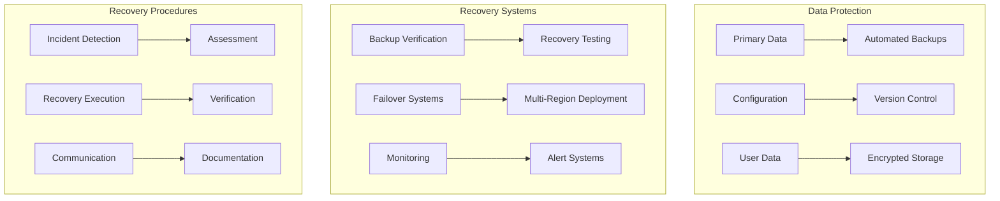
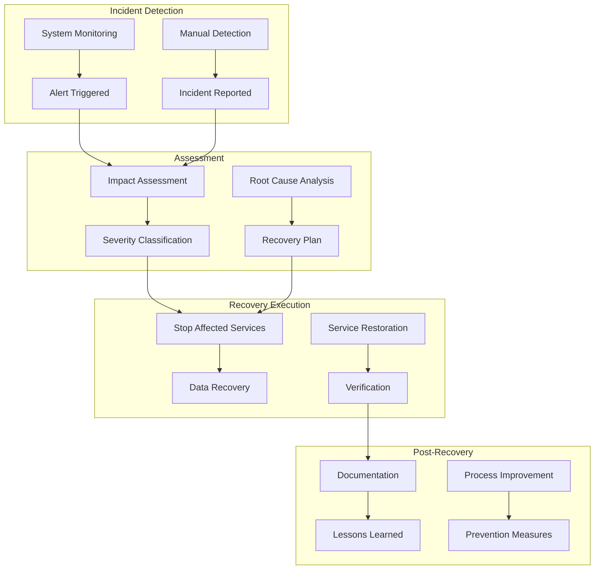
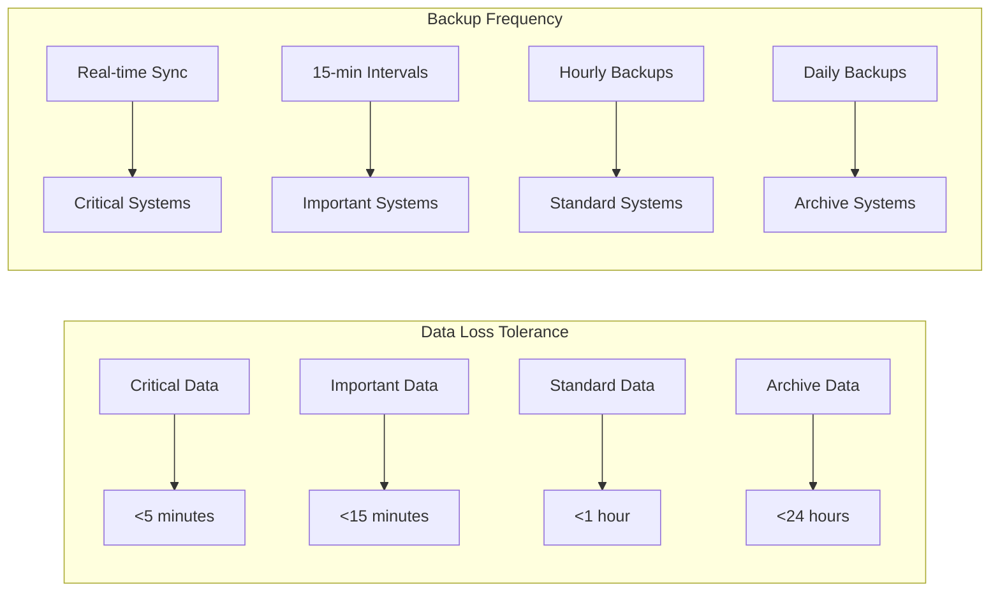

# 🚨 Disaster Recovery

This document provides comprehensive documentation for disaster recovery procedures, backup strategies, and business continuity planning for Friendlines v2.0.

## 🎯 Overview

Our disaster recovery strategy ensures business continuity and data protection through comprehensive backup procedures, automated recovery systems, and well-defined incident response protocols.

## 🏗️ Disaster Recovery Architecture



## 💾 Backup Strategy

### Data Backup Configuration

#### Automated Backup System

```javascript
// Backup configuration
const backupConfig = {
  schedule: {
    full: '0 2 * * *', // Daily at 2 AM
    incremental: '0 */6 * * *', // Every 6 hours
    verification: '0 3 * * *' // Daily at 3 AM
  },
  retention: {
    daily: 7, // Keep 7 daily backups
    weekly: 4, // Keep 4 weekly backups
    monthly: 12 // Keep 12 monthly backups
  },
  storage: {
    local: './backups/',
    remote: process.env.BACKUP_S3_BUCKET,
    encryption: true
  }
};

// Backup manager
class BackupManager {
  static async createBackup(type = 'full') {
    const timestamp = new Date().toISOString().replace(/[:.]/g, '-');
    const backupId = `backup-${type}-${timestamp}`;
    
    try {
      // Create backup directory
      const backupDir = path.join(backupConfig.storage.local, backupId);
      await fs.promises.mkdir(backupDir, { recursive: true });
      
      // Backup JSON data files
      await this.backupDataFiles(backupDir);
      
      // Backup SQLite database
      await this.backupDatabase(backupDir);
      
      // Backup configuration files
      await this.backupConfiguration(backupDir);
      
      // Create backup manifest
      await this.createManifest(backupDir, backupId, type);
      
      // Encrypt backup
      if (backupConfig.storage.encryption) {
        await this.encryptBackup(backupDir);
      }
      
      // Upload to remote storage
      await this.uploadToRemote(backupDir, backupId);
      
      // Clean up old backups
      await this.cleanupOldBackups();
      
      logger.info(`Backup completed: ${backupId}`);
      return backupId;
      
    } catch (error) {
      logger.error(`Backup failed: ${backupId}`, { error: error.message });
      throw error;
    }
  }

  static async backupDataFiles(backupDir) {
    const dataFiles = ['users.json', 'posts.json', 'groups.json', 'notifications.json'];
    
    for (const file of dataFiles) {
      const sourcePath = path.join('./data', file);
      const destPath = path.join(backupDir, file);
      
      if (await fs.promises.access(sourcePath).then(() => true).catch(() => false)) {
        await fs.promises.copyFile(sourcePath, destPath);
      }
    }
  }

  static async backupDatabase(backupDir) {
    const dbPath = './data/friendlines.db';
    const backupDbPath = path.join(backupDir, 'friendlines.db');
    
    if (await fs.promises.access(dbPath).then(() => true).catch(() => false)) {
      await fs.promises.copyFile(dbPath, backupDbPath);
    }
  }

  static async backupConfiguration(backupDir) {
    const configFiles = [
      'package.json',
      'package-lock.json',
      'Dockerfile',
      'docker-compose.yml',
      '.env.example'
    ];
    
    for (const file of configFiles) {
      const sourcePath = file;
      const destPath = path.join(backupDir, 'config', file);
      
      if (await fs.promises.access(sourcePath).then(() => true).catch(() => false)) {
        await fs.promises.mkdir(path.dirname(destPath), { recursive: true });
        await fs.promises.copyFile(sourcePath, destPath);
      }
    }
  }

  static async createManifest(backupDir, backupId, type) {
    const manifest = {
      backupId,
      type,
      timestamp: new Date().toISOString(),
      version: process.env.npm_package_version || '1.0.0',
      files: [],
      checksums: {}
    };
    
    // Generate file list and checksums
    const files = await this.getBackupFiles(backupDir);
    for (const file of files) {
      const relativePath = path.relative(backupDir, file);
      const checksum = await this.calculateChecksum(file);
      
      manifest.files.push(relativePath);
      manifest.checksums[relativePath] = checksum;
    }
    
    const manifestPath = path.join(backupDir, 'manifest.json');
    await fs.promises.writeFile(manifestPath, JSON.stringify(manifest, null, 2));
  }

  static async verifyBackup(backupId) {
    const backupDir = path.join(backupConfig.storage.local, backupId);
    const manifestPath = path.join(backupDir, 'manifest.json');
    
    try {
      const manifest = JSON.parse(await fs.promises.readFile(manifestPath, 'utf8'));
      
      for (const file of manifest.files) {
        const filePath = path.join(backupDir, file);
        const expectedChecksum = manifest.checksums[file];
        const actualChecksum = await this.calculateChecksum(filePath);
        
        if (expectedChecksum !== actualChecksum) {
          throw new Error(`Checksum mismatch for file: ${file}`);
        }
      }
      
      logger.info(`Backup verification passed: ${backupId}`);
      return true;
      
    } catch (error) {
      logger.error(`Backup verification failed: ${backupId}`, { error: error.message });
      return false;
    }
  }
}
```

### Backup Scheduling

```javascript
// Automated backup scheduler
const cron = require('node-cron');

// Daily full backup
cron.schedule(backupConfig.schedule.full, async () => {
  try {
    logger.info('Starting daily full backup...');
    const backupId = await BackupManager.createBackup('full');
    await BackupManager.verifyBackup(backupId);
    logger.info('Daily full backup completed successfully');
  } catch (error) {
    logger.error('Daily full backup failed', { error: error.message });
    // Send alert to operations team
    await sendBackupFailureAlert(error);
  }
});

// Incremental backup every 6 hours
cron.schedule(backupConfig.schedule.incremental, async () => {
  try {
    logger.info('Starting incremental backup...');
    const backupId = await BackupManager.createBackup('incremental');
    await BackupManager.verifyBackup(backupId);
    logger.info('Incremental backup completed successfully');
  } catch (error) {
    logger.error('Incremental backup failed', { error: error.message });
    await sendBackupFailureAlert(error);
  }
});

// Backup verification
cron.schedule(backupConfig.schedule.verification, async () => {
  try {
    logger.info('Starting backup verification...');
    const backups = await BackupManager.listBackups();
    
    for (const backup of backups.slice(-3)) { // Verify last 3 backups
      const isValid = await BackupManager.verifyBackup(backup.id);
      if (!isValid) {
        await sendBackupCorruptionAlert(backup.id);
      }
    }
    
    logger.info('Backup verification completed');
  } catch (error) {
    logger.error('Backup verification failed', { error: error.message });
  }
});
```

## 🔄 Recovery Procedures

### Data Recovery Process

```javascript
// Recovery manager
class RecoveryManager {
  static async initiateRecovery(backupId, options = {}) {
    const recoveryId = `recovery-${Date.now()}`;
    
    try {
      logger.info(`Starting recovery process: ${recoveryId} from backup: ${backupId}`);
      
      // Validate backup
      const isValid = await BackupManager.verifyBackup(backupId);
      if (!isValid) {
        throw new Error(`Backup validation failed: ${backupId}`);
      }
      
      // Create recovery plan
      const recoveryPlan = await this.createRecoveryPlan(backupId, options);
      
      // Execute recovery
      await this.executeRecovery(recoveryPlan);
      
      // Verify recovery
      await this.verifyRecovery(recoveryPlan);
      
      // Update system status
      await this.updateSystemStatus('recovered');
      
      logger.info(`Recovery completed successfully: ${recoveryId}`);
      return { recoveryId, status: 'completed' };
      
    } catch (error) {
      logger.error(`Recovery failed: ${recoveryId}`, { error: error.message });
      await this.rollbackRecovery(recoveryId);
      throw error;
    }
  }

  static async createRecoveryPlan(backupId, options) {
    const backupDir = path.join(backupConfig.storage.local, backupId);
    const manifestPath = path.join(backupDir, 'manifest.json');
    const manifest = JSON.parse(await fs.promises.readFile(manifestPath, 'utf8'));
    
    return {
      recoveryId: `recovery-${Date.now()}`,
      backupId,
      timestamp: new Date().toISOString(),
      manifest,
      options,
      steps: [
        'stop_application',
        'backup_current_state',
        'restore_data_files',
        'restore_database',
        'restore_configuration',
        'verify_integrity',
        'start_application',
        'verify_functionality'
      ],
      status: 'planned'
    };
  }

  static async executeRecovery(recoveryPlan) {
    logger.info(`Executing recovery plan: ${recoveryPlan.recoveryId}`);
    
    for (const step of recoveryPlan.steps) {
      try {
        logger.info(`Executing recovery step: ${step}`);
        await this.executeRecoveryStep(step, recoveryPlan);
        recoveryPlan.status = 'in_progress';
      } catch (error) {
        logger.error(`Recovery step failed: ${step}`, { error: error.message });
        throw error;
      }
    }
    
    recoveryPlan.status = 'completed';
  }

  static async executeRecoveryStep(step, recoveryPlan) {
    switch (step) {
      case 'stop_application':
        await this.stopApplication();
        break;
      case 'backup_current_state':
        await this.backupCurrentState(recoveryPlan.recoveryId);
        break;
      case 'restore_data_files':
        await this.restoreDataFiles(recoveryPlan);
        break;
      case 'restore_database':
        await this.restoreDatabase(recoveryPlan);
        break;
      case 'restore_configuration':
        await this.restoreConfiguration(recoveryPlan);
        break;
      case 'verify_integrity':
        await this.verifyDataIntegrity(recoveryPlan);
        break;
      case 'start_application':
        await this.startApplication();
        break;
      case 'verify_functionality':
        await this.verifyFunctionality();
        break;
      default:
        throw new Error(`Unknown recovery step: ${step}`);
    }
  }

  static async restoreDataFiles(recoveryPlan) {
    const backupDir = path.join(backupConfig.storage.local, recoveryPlan.backupId);
    const dataDir = './data';
    
    // Create data directory if it doesn't exist
    await fs.promises.mkdir(dataDir, { recursive: true });
    
    // Restore JSON files
    const dataFiles = ['users.json', 'posts.json', 'groups.json', 'notifications.json'];
    for (const file of dataFiles) {
      const sourcePath = path.join(backupDir, file);
      const destPath = path.join(dataDir, file);
      
      if (await fs.promises.access(sourcePath).then(() => true).catch(() => false)) {
        await fs.promises.copyFile(sourcePath, destPath);
        logger.info(`Restored data file: ${file}`);
      }
    }
  }

  static async restoreDatabase(recoveryPlan) {
    const backupDir = path.join(backupConfig.storage.local, recoveryPlan.backupId);
    const sourcePath = path.join(backupDir, 'friendlines.db');
    const destPath = './data/friendlines.db';
    
    if (await fs.promises.access(sourcePath).then(() => true).catch(() => false)) {
      await fs.promises.copyFile(sourcePath, destPath);
      logger.info('Restored database');
    }
  }

  static async verifyDataIntegrity(recoveryPlan) {
    // Verify data file integrity
    const dataFiles = ['users.json', 'posts.json', 'groups.json', 'notifications.json'];
    for (const file of dataFiles) {
      const filePath = path.join('./data', file);
      if (await fs.promises.access(filePath).then(() => true).catch(() => false)) {
        const content = await fs.promises.readFile(filePath, 'utf8');
        JSON.parse(content); // Verify JSON is valid
        logger.info(`Data integrity verified: ${file}`);
      }
    }
    
    // Verify database integrity
    try {
      const db = await sqlite.open('./data/friendlines.db');
      await db.get('SELECT 1');
      await db.close();
      logger.info('Database integrity verified');
    } catch (error) {
      throw new Error('Database integrity check failed');
    }
  }
}
```

### Recovery Endpoints

```javascript
// Recovery API endpoints
app.post('/api/admin/recovery/initiate', authenticateToken, authorizeRole(['admin']), async (req, res) => {
  try {
    const { backupId, options } = req.body;
    
    if (!backupId) {
      return res.status(400).json({
        success: false,
        message: 'Backup ID is required'
      });
    }
    
    const recovery = await RecoveryManager.initiateRecovery(backupId, options);
    
    res.json({
      success: true,
      message: 'Recovery initiated successfully',
      data: recovery
    });
  } catch (error) {
    res.status(500).json({
      success: false,
      message: 'Recovery failed',
      error: error.message
    });
  }
});

app.get('/api/admin/recovery/status/:recoveryId', authenticateToken, authorizeRole(['admin']), async (req, res) => {
  try {
    const { recoveryId } = req.params;
    const status = await RecoveryManager.getRecoveryStatus(recoveryId);
    
    res.json({
      success: true,
      data: status
    });
  } catch (error) {
    res.status(500).json({
      success: false,
      message: 'Failed to get recovery status',
      error: error.message
    });
  }
});

app.get('/api/admin/backups', authenticateToken, authorizeRole(['admin']), async (req, res) => {
  try {
    const backups = await BackupManager.listBackups();
    
    res.json({
      success: true,
      data: backups
    });
  } catch (error) {
    res.status(500).json({
      success: false,
      message: 'Failed to list backups',
      error: error.message
    });
  }
});
```

## 🚨 Incident Response

### Disaster Recovery Flow



### Incident Classification

| Severity | Description | Response Time | Recovery Time | Notification |
|----------|-------------|---------------|---------------|--------------|
| **Critical** | Complete system failure | <15 minutes | <1 hour | All stakeholders |
| **High** | Major functionality loss | <30 minutes | <4 hours | Operations team |
| **Medium** | Partial functionality loss | <1 hour | <8 hours | Development team |
| **Low** | Minor issues | <4 hours | <24 hours | Support team |

### Incident Response Procedures

```javascript
// Incident response system
class IncidentResponse {
  static async handleIncident(incident) {
    const response = {
      incidentId: this.generateIncidentId(),
      timestamp: new Date().toISOString(),
      severity: incident.severity,
      status: 'investigating',
      actions: []
    };

    try {
      // Immediate response
      await this.immediateResponse(incident, response);
      
      // Assessment
      await this.assessIncident(incident, response);
      
      // Recovery execution
      await this.executeRecovery(incident, response);
      
      // Post-recovery actions
      await this.postRecoveryActions(incident, response);
      
      response.status = 'resolved';
      await this.logIncident(response);
      
      return response;
      
    } catch (error) {
      response.status = 'failed';
      response.error = error.message;
      await this.logIncident(response);
      throw error;
    }
  }

  static async immediateResponse(incident, response) {
    // Stop affected services
    if (incident.severity === 'critical') {
      await this.stopAffectedServices(incident);
      response.actions.push('Stopped affected services');
    }
    
    // Notify stakeholders
    await this.notifyStakeholders(incident);
    response.actions.push('Notified stakeholders');
    
    // Initiate backup
    await BackupManager.createBackup('emergency');
    response.actions.push('Created emergency backup');
  }

  static async assessIncident(incident, response) {
    // Assess impact
    const impact = await this.assessImpact(incident);
    response.impact = impact;
    
    // Determine root cause
    const rootCause = await this.determineRootCause(incident);
    response.rootCause = rootCause;
    
    // Create recovery plan
    const recoveryPlan = await this.createRecoveryPlan(incident, impact);
    response.recoveryPlan = recoveryPlan;
  }

  static async executeRecovery(incident, response) {
    const recoveryPlan = response.recoveryPlan;
    
    for (const step of recoveryPlan.steps) {
      try {
        await this.executeRecoveryStep(step, incident);
        response.actions.push(`Completed: ${step}`);
      } catch (error) {
        response.actions.push(`Failed: ${step} - ${error.message}`);
        throw error;
      }
    }
  }

  static async postRecoveryActions(incident, response) {
    // Verify system functionality
    await this.verifySystemFunctionality();
    response.actions.push('Verified system functionality');
    
    // Monitor system health
    await this.monitorSystemHealth();
    response.actions.push('Initiated enhanced monitoring');
    
    // Document incident
    await this.documentIncident(response);
    response.actions.push('Documented incident');
  }
}
```

## 📊 Business Continuity

### Recovery Time Objectives (RTO)

| Service | RTO | RPO | Priority |
|---------|-----|-----|----------|
| **User Authentication** | 15 minutes | 5 minutes | Critical |
| **Post Creation** | 30 minutes | 10 minutes | High |
| **User Profiles** | 1 hour | 15 minutes | Medium |
| **Analytics** | 4 hours | 1 hour | Low |

### Recovery Point Objectives (RPO)



### Business Continuity Plan

```javascript
// Business continuity manager
class BusinessContinuityManager {
  static async activateContingencyPlan(incident) {
    const plan = {
      id: `bcp-${Date.now()}`,
      incident: incident,
      timestamp: new Date().toISOString(),
      status: 'activated'
    };

    try {
      // Activate backup systems
      await this.activateBackupSystems(plan);
      
      // Redirect traffic
      await this.redirectTraffic(plan);
      
      // Notify users
      await this.notifyUsers(plan);
      
      // Monitor performance
      await this.monitorPerformance(plan);
      
      plan.status = 'active';
      return plan;
      
    } catch (error) {
      plan.status = 'failed';
      plan.error = error.message;
      throw error;
    }
  }

  static async activateBackupSystems(plan) {
    // Switch to backup deployment
    const backupPlatforms = ['vercel', 'render'];
    
    for (const platform of backupPlatforms) {
      try {
        await this.deployToBackupPlatform(platform);
        plan.actions = plan.actions || [];
        plan.actions.push(`Deployed to ${platform}`);
      } catch (error) {
        logger.error(`Failed to deploy to ${platform}`, { error: error.message });
      }
    }
  }

  static async redirectTraffic(plan) {
    // Update DNS to point to backup systems
    // This would typically involve updating DNS records
    // or using a CDN with failover capabilities
    
    plan.actions = plan.actions || [];
    plan.actions.push('Traffic redirected to backup systems');
  }

  static async notifyUsers(plan) {
    // Send notifications to users about service status
    const notification = {
      type: 'service_status',
      message: 'We are experiencing technical difficulties. We are working to restore service as quickly as possible.',
      severity: 'info'
    };
    
    // Send via multiple channels
    await this.sendPushNotifications(notification);
    await this.sendEmailNotifications(notification);
    await this.updateStatusPage(notification);
    
    plan.actions = plan.actions || [];
    plan.actions.push('Users notified of service status');
  }
}
```

## 🔧 Testing & Validation

### Disaster Recovery Testing

```javascript
// DR testing framework
class DisasterRecoveryTesting {
  static async runRecoveryTest(testType = 'full') {
    const testId = `dr-test-${Date.now()}`;
    
    try {
      logger.info(`Starting DR test: ${testId} (${testType})`);
      
      // Create test environment
      const testEnv = await this.createTestEnvironment(testId);
      
      // Simulate disaster
      await this.simulateDisaster(testEnv);
      
      // Execute recovery
      const recoveryResult = await RecoveryManager.initiateRecovery(
        testEnv.backupId,
        { testMode: true }
      );
      
      // Verify recovery
      const verificationResult = await this.verifyRecovery(testEnv);
      
      // Cleanup
      await this.cleanupTestEnvironment(testEnv);
      
      const testResult = {
        testId,
        type: testType,
        status: 'passed',
        recoveryTime: recoveryResult.duration,
        verificationResult,
        timestamp: new Date().toISOString()
      };
      
      await this.logTestResult(testResult);
      logger.info(`DR test completed: ${testId}`);
      
      return testResult;
      
    } catch (error) {
      const testResult = {
        testId,
        type: testType,
        status: 'failed',
        error: error.message,
        timestamp: new Date().toISOString()
      };
      
      await this.logTestResult(testResult);
      logger.error(`DR test failed: ${testId}`, { error: error.message });
      
      throw error;
    }
  }

  static async simulateDisaster(testEnv) {
    // Simulate data corruption
    await this.corruptDataFiles();
    
    // Simulate database failure
    await this.corruptDatabase();
    
    // Simulate configuration issues
    await this.corruptConfiguration();
    
    logger.info('Disaster simulation completed');
  }

  static async verifyRecovery(testEnv) {
    const checks = [
      this.verifyDataIntegrity(),
      this.verifyDatabaseIntegrity(),
      this.verifyApplicationFunctionality(),
      this.verifyUserAccess(),
      this.verifyPerformance()
    ];
    
    const results = await Promise.all(checks);
    return results.every(result => result === true);
  }
}

// Automated DR testing schedule
cron.schedule('0 2 * * 0', async () => { // Weekly on Sunday at 2 AM
  try {
    await DisasterRecoveryTesting.runRecoveryTest('full');
    logger.info('Weekly DR test completed successfully');
  } catch (error) {
    logger.error('Weekly DR test failed', { error: error.message });
    await sendDRTestFailureAlert(error);
  }
});
```

---

## 🔗 Related Documentation

- [Architecture Overview](./architecture-overview.md)
- [Infrastructure as Code](./infrastructure-as-code.md)
- [Monitoring & Observability](./monitoring-observability.md)
- [Security & Compliance](./security-compliance.md)

---

**Last Updated**: December 2024  
**Version**: 2.0.0  
**Maintainer**: DevOps Team 