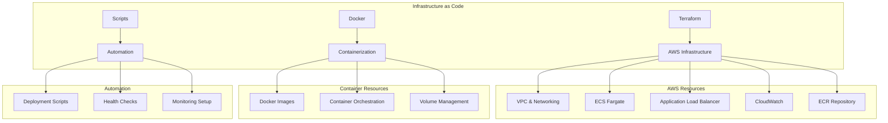
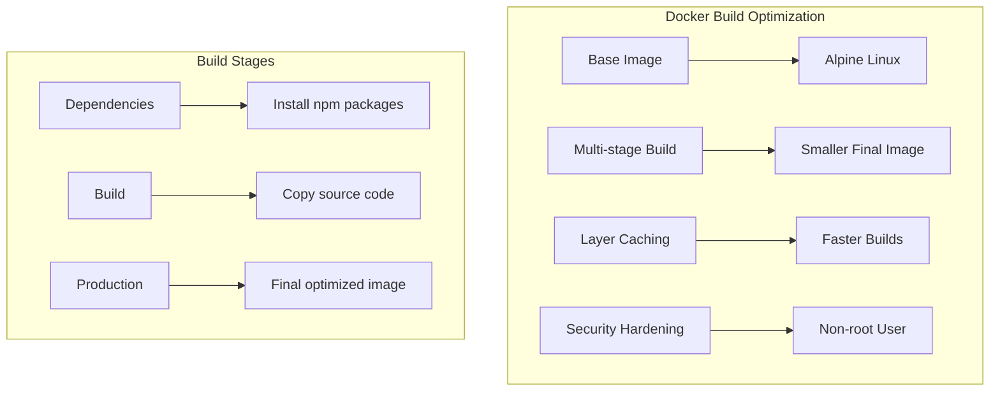
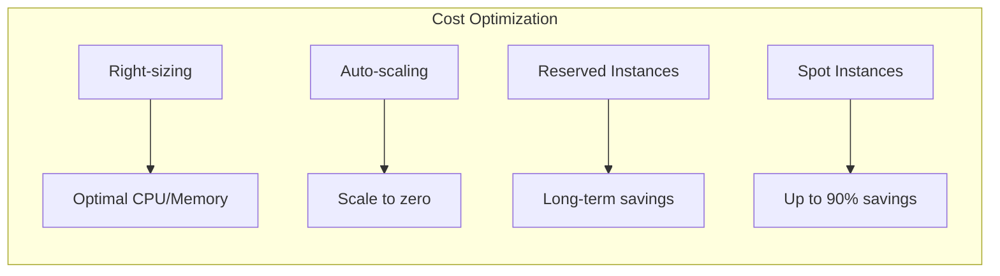

# 🏗️ Infrastructure as Code

This document provides comprehensive documentation for the Infrastructure as Code (IaC) implementation in Friendlines v2.0, including Terraform configurations, Docker setups, and automation scripts.

## 🎯 Overview

Infrastructure as Code (IaC) enables us to manage and provision infrastructure through code rather than manual processes. This approach provides version control, consistency, and automation for our infrastructure deployments.

## 🏗️ Infrastructure Components



## 🔧 Terraform Configuration

### Project Structure

```
terraform/
├── main.tf              # Main infrastructure configuration
├── variables.tf         # Input variables
├── outputs.tf          # Output values
├── providers.tf        # Provider configuration
├── versions.tf         # Version constraints
└── modules/            # Reusable modules
    ├── networking/     # VPC and networking
    ├── compute/        # ECS and compute resources
    ├── storage/        # S3 and storage resources
    └── monitoring/     # CloudWatch and monitoring
```

### Main Configuration

#### `terraform/main.tf`

```hcl
# AWS Free Tier deployment for Friendlines Backend
terraform {
  required_version = ">= 1.0"
  
  required_providers {
    aws = {
      source  = "hashicorp/aws"
      version = "~> 5.0"
    }
  }
  
  # Store state in S3 (optional, comment out for local state)
  # backend "s3" {
  #   bucket = "friendlines-terraform-state"
  #   key    = "backend/terraform.tfstate"
  #   region = "us-east-1"
  # }
}

# Configure AWS Provider
provider "aws" {
  region = var.aws_region
  
  default_tags {
    tags = {
      Project     = "Friendlines"
      Environment = var.environment
      ManagedBy   = "Terraform"
    }
  }
}

# Data sources
data "aws_availability_zones" "available" {
  state = "available"
}

# VPC Configuration
resource "aws_vpc" "main" {
  cidr_block           = var.vpc_cidr
  enable_dns_hostnames = true
  enable_dns_support   = true
  
  tags = {
    Name = "${var.project_name}-vpc"
  }
}

# Internet Gateway
resource "aws_internet_gateway" "main" {
  vpc_id = aws_vpc.main.id
  
  tags = {
    Name = "${var.project_name}-igw"
  }
}

# Public Subnets
resource "aws_subnet" "public" {
  count = 2
  
  vpc_id                  = aws_vpc.main.id
  cidr_block              = cidrsubnet(var.vpc_cidr, 8, count.index)
  availability_zone       = data.aws_availability_zones.available.names[count.index]
  map_public_ip_on_launch = true
  
  tags = {
    Name = "${var.project_name}-public-subnet-${count.index + 1}"
  }
}

# Route Table
resource "aws_route_table" "public" {
  vpc_id = aws_vpc.main.id
  
  route {
    cidr_block = "0.0.0.0/0"
    gateway_id = aws_internet_gateway.main.id
  }
  
  tags = {
    Name = "${var.project_name}-public-rt"
  }
}

# Route Table Association
resource "aws_route_table_association" "public" {
  count = length(aws_subnet.public)
  
  subnet_id      = aws_subnet.public[count.index].id
  route_table_id = aws_route_table.public.id
}

# Security Groups
resource "aws_security_group" "alb" {
  name_prefix = "${var.project_name}-alb-"
  vpc_id      = aws_vpc.main.id
  
  ingress {
    from_port   = 80
    to_port     = 80
    protocol    = "tcp"
    cidr_blocks = ["0.0.0.0/0"]
  }
  
  ingress {
    from_port   = 443
    to_port     = 443
    protocol    = "tcp"
    cidr_blocks = ["0.0.0.0/0"]
  }
  
  egress {
    from_port   = 0
    to_port     = 0
    protocol    = "-1"
    cidr_blocks = ["0.0.0.0/0"]
  }
  
  tags = {
    Name = "${var.project_name}-alb-sg"
  }
}

resource "aws_security_group" "ecs_tasks" {
  name_prefix = "${var.project_name}-ecs-tasks-"
  vpc_id      = aws_vpc.main.id
  
  ingress {
    from_port       = 3000
    to_port         = 3000
    protocol        = "tcp"
    security_groups = [aws_security_group.alb.id]
  }
  
  egress {
    from_port   = 0
    to_port     = 0
    protocol    = "-1"
    cidr_blocks = ["0.0.0.0/0"]
  }
  
  tags = {
    Name = "${var.project_name}-ecs-tasks-sg"
  }
}

# Application Load Balancer
resource "aws_lb" "main" {
  name               = "${var.project_name}-alb"
  internal           = false
  load_balancer_type = "application"
  security_groups    = [aws_security_group.alb.id]
  subnets            = aws_subnet.public[*].id
  
  enable_deletion_protection = false
  
  tags = {
    Name = "${var.project_name}-alb"
  }
}

# Target Group
resource "aws_lb_target_group" "app" {
  name        = "${var.project_name}-tg"
  port        = 3000
  protocol    = "HTTP"
  vpc_id      = aws_vpc.main.id
  target_type = "ip"
  
  health_check {
    enabled             = true
    healthy_threshold   = 2
    interval            = 30
    matcher             = "200"
    path                = "/health"
    port                = "traffic-port"
    protocol            = "HTTP"
    timeout             = 5
    unhealthy_threshold = 2
  }
  
  tags = {
    Name = "${var.project_name}-tg"
  }
}

# Load Balancer Listener
resource "aws_lb_listener" "app" {
  load_balancer_arn = aws_lb.main.arn
  port              = "80"
  protocol          = "HTTP"
  
  default_action {
    type             = "forward"
    target_group_arn = aws_lb_target_group.app.arn
  }
}

# ECS Cluster
resource "aws_ecs_cluster" "main" {
  name = "${var.project_name}-cluster"
  
  setting {
    name  = "containerInsights"
    value = "enabled"
  }
  
  tags = {
    Name = "${var.project_name}-cluster"
  }
}

# ECS Task Definition
resource "aws_ecs_task_definition" "app" {
  family                   = "${var.project_name}-task"
  network_mode             = "awsvpc"
  requires_compatibilities = ["FARGATE"]
  cpu                      = var.task_cpu
  memory                   = var.task_memory
  execution_role_arn       = aws_iam_role.ecs_execution_role.arn
  task_role_arn            = aws_iam_role.ecs_task_role.arn
  
  container_definitions = jsonencode([
    {
      name  = "${var.project_name}-container"
      image = "${aws_ecr_repository.app.repository_url}:latest"
      
      portMappings = [
        {
          containerPort = 3000
          protocol      = "tcp"
        }
      ]
      
      environment = [
        {
          name  = "NODE_ENV"
          value = "production"
        },
        {
          name  = "PORT"
          value = "3000"
        }
      ]
      
      logConfiguration = {
        logDriver = "awslogs"
        options = {
          awslogs-group         = aws_cloudwatch_log_group.app.name
          awslogs-region        = var.aws_region
          awslogs-stream-prefix = "ecs"
        }
      }
      
      healthCheck = {
        command     = ["CMD-SHELL", "curl -f http://localhost:3000/health || exit 1"]
        interval    = 30
        timeout     = 5
        retries     = 3
        startPeriod = 60
      }
    }
  ])
  
  tags = {
    Name = "${var.project_name}-task-definition"
  }
}

# ECS Service
resource "aws_ecs_service" "app" {
  name            = "${var.project_name}-service"
  cluster         = aws_ecs_cluster.main.id
  task_definition = aws_ecs_task_definition.app.arn
  desired_count   = var.service_desired_count
  launch_type     = "FARGATE"
  
  network_configuration {
    subnets          = aws_subnet.public[*].id
    security_groups  = [aws_security_group.ecs_tasks.id]
    assign_public_ip = true
  }
  
  load_balancer {
    target_group_arn = aws_lb_target_group.app.arn
    container_name   = "${var.project_name}-container"
    container_port   = 3000
  }
  
  depends_on = [aws_lb_listener.app]
  
  tags = {
    Name = "${var.project_name}-service"
  }
}

# CloudWatch Log Group
resource "aws_cloudwatch_log_group" "app" {
  name              = "/ecs/${var.project_name}"
  retention_in_days = 7
  
  tags = {
    Name = "${var.project_name}-log-group"
  }
}

# ECR Repository
resource "aws_ecr_repository" "app" {
  name                 = "${var.project_name}"
  image_tag_mutability = "MUTABLE"
  
  image_scanning_configuration {
    scan_on_push = true
  }
  
  tags = {
    Name = "${var.project_name}-ecr"
  }
}

# IAM Roles
resource "aws_iam_role" "ecs_execution_role" {
  name = "${var.project_name}-ecs-execution-role"
  
  assume_role_policy = jsonencode({
    Version = "2012-10-17"
    Statement = [
      {
        Action = "sts:AssumeRole"
        Effect = "Allow"
        Principal = {
          Service = "ecs-tasks.amazonaws.com"
        }
      }
    ]
  })
  
  tags = {
    Name = "${var.project_name}-ecs-execution-role"
  }
}

resource "aws_iam_role" "ecs_task_role" {
  name = "${var.project_name}-ecs-task-role"
  
  assume_role_policy = jsonencode({
    Version = "2012-10-17"
    Statement = [
      {
        Action = "sts:AssumeRole"
        Effect = "Allow"
        Principal = {
          Service = "ecs-tasks.amazonaws.com"
        }
      }
    ]
  })
  
  tags = {
    Name = "${var.project_name}-ecs-task-role"
  }
}

# IAM Role Policy Attachments
resource "aws_iam_role_policy_attachment" "ecs_execution_role_policy" {
  role       = aws_iam_role.ecs_execution_role.name
  policy_arn = "arn:aws:iam::aws:policy/service-role/AmazonECSTaskExecutionRolePolicy"
}
```

### Variables Configuration

#### `terraform/variables.tf`

```hcl
variable "aws_region" {
  description = "AWS region"
  type        = string
  default     = "us-east-1"
}

variable "project_name" {
  description = "Project name"
  type        = string
  default     = "friendlines"
}

variable "environment" {
  description = "Environment name"
  type        = string
  default     = "production"
}

variable "vpc_cidr" {
  description = "VPC CIDR block"
  type        = string
  default     = "10.0.0.0/16"
}

variable "task_cpu" {
  description = "ECS task CPU units"
  type        = number
  default     = 256
}

variable "task_memory" {
  description = "ECS task memory (MiB)"
  type        = number
  default     = 512
}

variable "service_desired_count" {
  description = "Desired number of ECS tasks"
  type        = number
  default     = 1
}

variable "domain_name" {
  description = "Domain name for the application"
  type        = string
  default     = ""
}

variable "certificate_arn" {
  description = "SSL certificate ARN"
  type        = string
  default     = ""
}
```

### Outputs Configuration

#### `terraform/outputs.tf`

```hcl
output "alb_dns_name" {
  description = "DNS name of the load balancer"
  value       = aws_lb.main.dns_name
}

output "alb_zone_id" {
  description = "Zone ID of the load balancer"
  value       = aws_lb.main.zone_id
}

output "ecr_repository_url" {
  description = "URL of the ECR repository"
  value       = aws_ecr_repository.app.repository_url
}

output "ecs_cluster_name" {
  description = "Name of the ECS cluster"
  value       = aws_ecs_cluster.main.name
}

output "ecs_service_name" {
  description = "Name of the ECS service"
  value       = aws_ecs_service.app.name
}

output "cloudwatch_log_group" {
  description = "Name of the CloudWatch log group"
  value       = aws_cloudwatch_log_group.app.name
}

output "vpc_id" {
  description = "ID of the VPC"
  value       = aws_vpc.main.id
}

output "public_subnet_ids" {
  description = "IDs of the public subnets"
  value       = aws_subnet.public[*].id
}
```

## 🐳 Docker Configuration

### Multi-Stage Dockerfile

```dockerfile
# Multi-stage build for optimized production image
FROM node:20-alpine AS base

# Set working directory
WORKDIR /app

# Install security updates and required packages
RUN apk update && apk upgrade && \
    apk add --no-cache dumb-init && \
    rm -rf /var/cache/apk/*

# Create non-root user for security
RUN addgroup -g 1001 -S nodejs && \
    adduser -S nodejs -u 1001

# Dependencies stage
FROM base AS deps
COPY package*.json ./
RUN npm ci --only=production && npm cache clean --force

# Build stage
FROM base AS build
COPY package*.json ./
RUN npm ci
COPY . .

# Production stage
FROM base AS production

# Copy application files
COPY --from=deps /app/node_modules ./node_modules
COPY --from=build /app .

# Create required directories
RUN mkdir -p data uploads logs && \
    chown -R nodejs:nodejs /app

# Switch to non-root user
USER nodejs

# Expose port
EXPOSE 3000

# Add health check
HEALTHCHECK --interval=30s --timeout=10s --start-period=60s --retries=3 \
  CMD node -e "require('http').get('http://localhost:3000/health', (res) => { process.exit(res.statusCode === 200 ? 0 : 1) })"

# Start application with proper signal handling
ENTRYPOINT ["dumb-init", "--"]
CMD ["npm", "start"]
```

### Docker Compose Configuration

#### `docker-compose.yml`

```yaml
version: '3.8'

services:
  friendlines-backend:
    build:
      context: .
      dockerfile: Dockerfile
      target: production
    ports:
      - "3000:3000"
    environment:
      - NODE_ENV=production
      - PORT=3000
    volumes:
      - ./data:/app/data
      - ./uploads:/app/uploads
      - ./logs:/app/logs
    restart: unless-stopped
    healthcheck:
      test: ["CMD", "node", "-e", "require('http').get('http://localhost:3000/health', (res) => { process.exit(res.statusCode === 200 ? 0 : 1) })"]
      interval: 30s
      timeout: 10s
      retries: 3
      start_period: 60s
    networks:
      - friendlines-network

  # Optional: Add reverse proxy for production-like setup
  nginx:
    image: nginx:alpine
    ports:
      - "80:80"
      - "443:443"
    volumes:
      - ./nginx.conf:/etc/nginx/nginx.conf:ro
      - ./ssl:/etc/nginx/ssl:ro
    depends_on:
      - friendlines-backend
    networks:
      - friendlines-network
    profiles:
      - with-proxy

networks:
  friendlines-network:
    driver: bridge

volumes:
  app-data:
  app-uploads:
  app-logs:
```

### Docker Optimization



## 🔧 Automation Scripts

### Deployment Script

#### `scripts/deploy.sh`

```bash
#!/bin/bash

# Friendlines Backend Deployment Script
# This script automates the deployment process for different platforms

set -e  # Exit on any error

# Colors for output
RED='\033[0;31m'
GREEN='\033[0;32m'
YELLOW='\033[1;33m'
BLUE='\033[0;34m'
NC='\033[0m' # No Color

# Configuration
PROJECT_NAME="friendlines-backend"
NODE_VERSION="20"
PLATFORMS=("railway" "vercel" "render" "aws")

# Functions
log_info() {
    echo -e "${BLUE}ℹ️  $1${NC}"
}

log_success() {
    echo -e "${GREEN}✅ $1${NC}"
}

log_warning() {
    echo -e "${YELLOW}⚠️  $1${NC}"
}

log_error() {
    echo -e "${RED}❌ $1${NC}"
}

check_dependencies() {
    log_info "Checking dependencies..."
    
    # Check Node.js
    if ! command -v node &> /dev/null; then
        log_error "Node.js is not installed"
        exit 1
    fi
    
    local node_version=$(node --version | cut -d'v' -f2 | cut -d'.' -f1)
    if [ "$node_version" -lt "18" ]; then
        log_error "Node.js version 18 or higher is required"
        exit 1
    fi
    
    # Check npm
    if ! command -v npm &> /dev/null; then
        log_error "npm is not installed"
        exit 1
    fi
    
    log_success "Dependencies check passed"
}

run_tests() {
    log_info "Running tests..."
    
    if ! npm test; then
        log_error "Tests failed"
        exit 1
    fi
    
    log_success "All tests passed"
}

setup_environment() {
    local platform=$1
    log_info "Setting up environment for $platform..."
    
    # Create .env file if it doesn't exist
    if [ ! -f .env ]; then
        log_info "Creating .env file..."
        cat > .env << EOF
NODE_ENV=production
PORT=3000
# Add other environment variables here
EOF
        log_warning "Please update .env file with your configuration"
    fi
    
    log_success "Environment setup complete"
}

deploy_railway() {
    log_info "Deploying to Railway..."
    
    if ! command -v railway &> /dev/null; then
        log_info "Installing Railway CLI..."
        npm install -g @railway/cli
    fi
    
    # Login check
    if ! railway whoami &> /dev/null; then
        log_error "Please login to Railway first: railway login"
        exit 1
    fi
    
    # Deploy
    railway up
    
    log_success "Deployed to Railway successfully"
}

deploy_vercel() {
    log_info "Deploying to Vercel..."
    
    if ! command -v vercel &> /dev/null; then
        log_info "Installing Vercel CLI..."
        npm install -g vercel
    fi
    
    # Deploy
    vercel --prod
    
    log_success "Deployed to Vercel successfully"
}

deploy_render() {
    log_info "Deploying to Render..."
    
    if [ ! -f render.yaml ]; then
        log_error "render.yaml not found. Please create it first."
        exit 1
    fi
    
    log_info "Please push your changes to trigger Render deployment"
    log_info "Or use Render CLI if available"
    
    log_success "Render deployment initiated"
}

deploy_aws() {
    log_info "Deploying to AWS using Terraform..."
    
    # Check AWS CLI
    if ! command -v aws &> /dev/null; then
        log_error "AWS CLI is not installed"
        exit 1
    fi
    
    # Check Terraform
    if ! command -v terraform &> /dev/null; then
        log_error "Terraform is not installed"
        exit 1
    fi
    
    # Check Docker
    if ! command -v docker &> /dev/null; then
        log_error "Docker is not installed"
        exit 1
    fi
    
    cd terraform
    
    # Initialize Terraform
    terraform init
    
    # Plan deployment
    terraform plan
    
    # Ask for confirmation
    read -p "Do you want to apply the Terraform plan? (y/N): " confirm
    if [[ $confirm == [yY] ]]; then
        terraform apply
        log_success "AWS deployment completed"
    else
        log_info "AWS deployment cancelled"
    fi
    
    cd ..
}

build_docker() {
    log_info "Building Docker image..."
    
    if ! command -v docker &> /dev/null; then
        log_error "Docker is not installed"
        exit 1
    fi
    
    docker build -t $PROJECT_NAME:latest .
    
    log_success "Docker image built successfully"
}

health_check() {
    local url=$1
    log_info "Performing health check on $url..."
    
    for i in {1..10}; do
        if curl -f -s "$url/health" > /dev/null; then
            log_success "Health check passed!"
            return 0
        else
            log_warning "Health check failed, retrying in 10s... ($i/10)"
            sleep 10
        fi
    done
    
    log_error "Health check failed after 10 attempts"
    return 1
}

# Main script logic
main() {
    local platform=$1
    
    if [ -z "$platform" ]; then
        log_error "Please specify a platform: railway, vercel, render, aws, or docker"
        exit 1
    fi
    
    log_info "Starting deployment to $platform..."
    
    # Pre-deployment checks
    check_dependencies
    run_tests
    setup_environment $platform
    
    # Platform-specific deployment
    case $platform in
        "railway")
            deploy_railway
            ;;
        "vercel")
            deploy_vercel
            ;;
        "render")
            deploy_render
            ;;
        "aws")
            deploy_aws
            ;;
        "docker")
            build_docker
            ;;
        *)
            log_error "Invalid platform: $platform"
            log_info "Available platforms: railway, vercel, render, aws, docker"
            exit 1
            ;;
    esac
    
    log_success "Deployment to $platform completed successfully!"
}

# Run main function with all arguments
main "$@"
```

### Infrastructure Management Script

#### `scripts/infrastructure.sh`

```bash
#!/bin/bash

# Infrastructure Management Script
# This script manages AWS infrastructure using Terraform

set -e

# Colors for output
RED='\033[0;31m'
GREEN='\033[0;32m'
YELLOW='\033[1;33m'
BLUE='\033[0;34m'
NC='\033[0m'

# Functions
log_info() {
    echo -e "${BLUE}ℹ️  $1${NC}"
}

log_success() {
    echo -e "${GREEN}✅ $1${NC}"
}

log_warning() {
    echo -e "${YELLOW}⚠️  $1${NC}"
}

log_error() {
    echo -e "${RED}❌ $1${NC}"
}

# Check prerequisites
check_prerequisites() {
    log_info "Checking prerequisites..."
    
    # Check AWS CLI
    if ! command -v aws &> /dev/null; then
        log_error "AWS CLI is not installed"
        exit 1
    fi
    
    # Check Terraform
    if ! command -v terraform &> /dev/null; then
        log_error "Terraform is not installed"
        exit 1
    fi
    
    # Check Docker
    if ! command -v docker &> /dev/null; then
        log_error "Docker is not installed"
        exit 1
    fi
    
    log_success "Prerequisites check passed"
}

# Initialize Terraform
init_terraform() {
    log_info "Initializing Terraform..."
    
    cd terraform
    
    # Initialize Terraform
    terraform init
    
    log_success "Terraform initialized"
    cd ..
}

# Plan infrastructure changes
plan_infrastructure() {
    log_info "Planning infrastructure changes..."
    
    cd terraform
    
    # Plan Terraform changes
    terraform plan -out=tfplan
    
    log_success "Infrastructure plan created"
    cd ..
}

# Apply infrastructure changes
apply_infrastructure() {
    log_info "Applying infrastructure changes..."
    
    cd terraform
    
    # Apply Terraform changes
    terraform apply tfplan
    
    log_success "Infrastructure changes applied"
    cd ..
}

# Destroy infrastructure
destroy_infrastructure() {
    log_info "Destroying infrastructure..."
    
    cd terraform
    
    # Ask for confirmation
    read -p "Are you sure you want to destroy all infrastructure? (yes/no): " confirm
    if [ "$confirm" = "yes" ]; then
        terraform destroy
        log_success "Infrastructure destroyed"
    else
        log_info "Infrastructure destruction cancelled"
    fi
    
    cd ..
}

# Build and push Docker image
build_and_push_image() {
    log_info "Building and pushing Docker image..."
    
    # Get AWS account ID and region
    AWS_ACCOUNT_ID=$(aws sts get-caller-identity --query Account --output text)
    AWS_REGION=$(aws configure get region)
    
    # Build Docker image
    docker build -t friendlines-backend .
    
    # Tag for ECR
    docker tag friendlines-backend:latest $AWS_ACCOUNT_ID.dkr.ecr.$AWS_REGION.amazonaws.com/friendlines-backend:latest
    
    # Login to ECR
    aws ecr get-login-password --region $AWS_REGION | docker login --username AWS --password-stdin $AWS_ACCOUNT_ID.dkr.ecr.$AWS_REGION.amazonaws.com
    
    # Push to ECR
    docker push $AWS_ACCOUNT_ID.dkr.ecr.$AWS_REGION.amazonaws.com/friendlines-backend:latest
    
    log_success "Docker image built and pushed"
}

# Update ECS service
update_ecs_service() {
    log_info "Updating ECS service..."
    
    # Force new deployment
    aws ecs update-service --cluster friendlines-cluster --service friendlines-service --force-new-deployment
    
    log_success "ECS service updated"
}

# Show infrastructure status
show_status() {
    log_info "Showing infrastructure status..."
    
    cd terraform
    
    # Show Terraform outputs
    terraform output
    
    cd ..
    
    # Show ECS service status
    aws ecs describe-services --cluster friendlines-cluster --services friendlines-service --query 'services[0].{Status:status,RunningCount:runningCount,DesiredCount:desiredCount}' --output table
}

# Main function
main() {
    local action=$1
    
    check_prerequisites
    
    case $action in
        "init")
            init_terraform
            ;;
        "plan")
            plan_infrastructure
            ;;
        "apply")
            apply_infrastructure
            ;;
        "destroy")
            destroy_infrastructure
            ;;
        "build")
            build_and_push_image
            ;;
        "deploy")
            update_ecs_service
            ;;
        "status")
            show_status
            ;;
        "full-deploy")
            init_terraform
            plan_infrastructure
            apply_infrastructure
            build_and_push_image
            update_ecs_service
            ;;
        *)
            log_error "Invalid action: $action"
            log_info "Available actions: init, plan, apply, destroy, build, deploy, status, full-deploy"
            exit 1
            ;;
    esac
}

# Run main function
main "$@"
```

## 📊 Infrastructure Monitoring

### CloudWatch Dashboard

```json
{
  "widgets": [
    {
      "type": "metric",
      "properties": {
        "metrics": [
          ["AWS/ECS", "CPUUtilization", "ServiceName", "friendlines-service", "ClusterName", "friendlines-cluster"],
          [".", "MemoryUtilization", ".", ".", ".", "."]
        ],
        "period": 300,
        "stat": "Average",
        "region": "us-east-1",
        "title": "ECS Service Metrics"
      }
    },
    {
      "type": "metric",
      "properties": {
        "metrics": [
          ["AWS/ApplicationELB", "RequestCount", "LoadBalancer", "friendlines-alb"],
          [".", "TargetResponseTime", ".", "."]
        ],
        "period": 300,
        "stat": "Sum",
        "region": "us-east-1",
        "title": "Load Balancer Metrics"
      }
    }
  ]
}
```

### Infrastructure Health Checks

```mermaid
graph TB
    subgraph "Health Check Components"
        A[ECS Service Health] --> B[Task Health]
        C[Load Balancer Health] --> D[Target Health]
        E[Application Health] --> F[/health Endpoint]
    end
    
    subgraph "Monitoring"
        G[CloudWatch Alarms] --> H[CPU Utilization]
        I[CloudWatch Alarms] --> J[Memory Utilization]
        K[CloudWatch Alarms] --> L[Error Rate]
    end
    
    B --> G
    D --> I
    F --> K
```

## 🔐 Security Configuration

### IAM Policies

```json
{
  "Version": "2012-10-17",
  "Statement": [
    {
      "Effect": "Allow",
      "Action": [
        "ecr:GetAuthorizationToken",
        "ecr:BatchCheckLayerAvailability",
        "ecr:GetDownloadUrlForLayer",
        "ecr:BatchGetImage"
      ],
      "Resource": "*"
    },
    {
      "Effect": "Allow",
      "Action": [
        "logs:CreateLogStream",
        "logs:PutLogEvents"
      ],
      "Resource": "arn:aws:logs:*:*:log-group:/ecs/friendlines:*"
    }
  ]
}
```

### Security Best Practices

| Practice | Implementation | Status |
|----------|----------------|--------|
| **Least Privilege** | IAM roles with minimal permissions | ✅ |
| **Network Security** | Security groups with restricted access | ✅ |
| **Container Security** | Non-root user, security scanning | ✅ |
| **Secret Management** | AWS Secrets Manager integration | ⚠️ |
| **Encryption** | TLS in transit, encryption at rest | ✅ |

## 📈 Cost Optimization

### AWS Free Tier Usage

| Service | Free Tier Limit | Current Usage | Status |
|---------|-----------------|---------------|--------|
| **EC2** | 750 hours/month | 0 hours | ✅ |
| **ECS Fargate** | 1 vCPU, 1GB RAM | 0.25 vCPU, 0.5GB RAM | ✅ |
| **ALB** | 750 hours/month | 0 hours | ✅ |
| **CloudWatch** | 5GB logs/month | <1GB | ✅ |
| **ECR** | 500MB storage | <100MB | ✅ |

### Cost Optimization Strategies



---

## 🔗 Related Documentation

- [Architecture Overview](./architecture-overview.md)
- [Deployment Platforms](./deployment-platforms.md)
- [CI/CD Pipeline](./ci-cd-pipeline.md)
- [Monitoring & Observability](./monitoring-observability.md)

---

**Last Updated**: December 2024  
**Version**: 2.0.0  
**Maintainer**: DevOps Team 