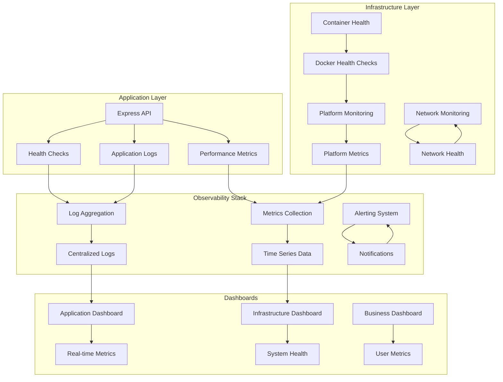
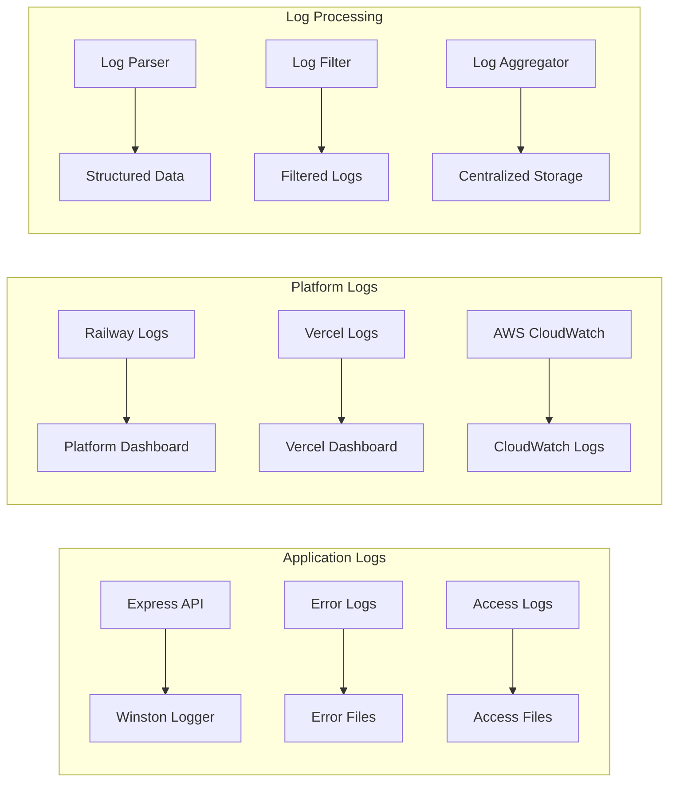
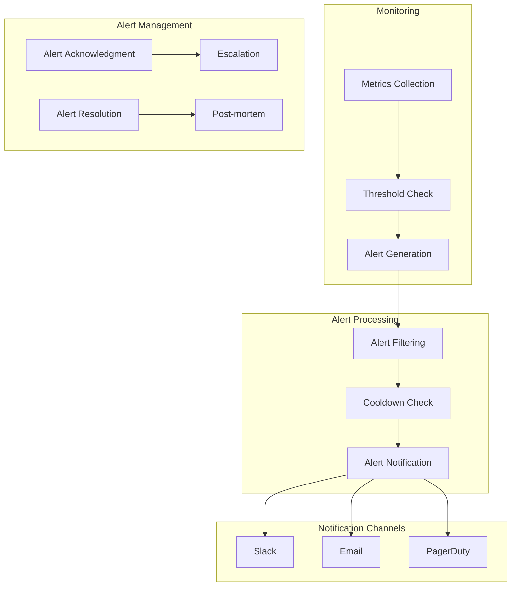
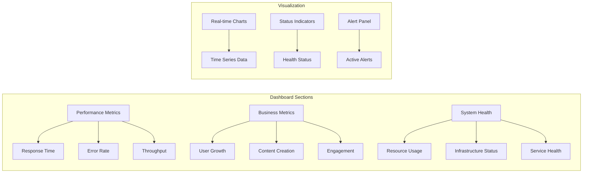
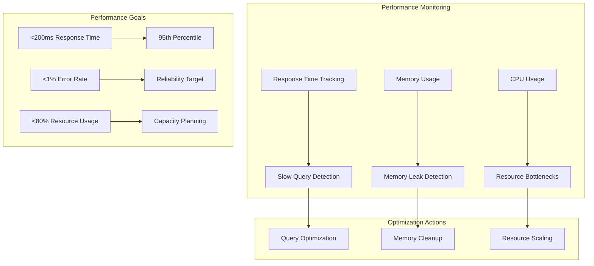
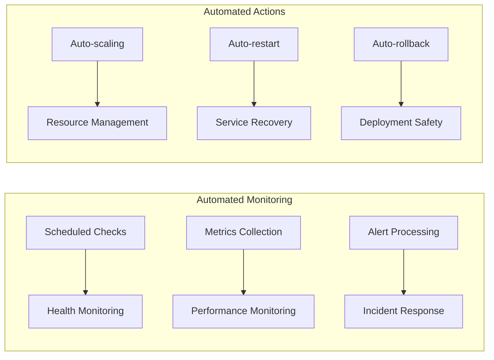

# 📊 Monitoring & Observability

This document provides comprehensive documentation for the monitoring and observability infrastructure of Friendlines v2.0, including health checks, logging, metrics collection, and alerting systems.

## 🎯 Overview

Our monitoring and observability strategy ensures high availability, performance, and reliability of the Friendlines application through comprehensive health checks, structured logging, metrics collection, and proactive alerting.

## 🏗️ Monitoring Architecture



## 🏥 Health Checks

### Application Health Endpoint

#### Implementation

```javascript
// Health check endpoint
app.get('/health', async (req, res) => {
  try {
    const healthCheck = {
      status: 'healthy',
      timestamp: new Date().toISOString(),
      uptime: process.uptime(),
      version: process.env.npm_package_version || '1.0.0',
      environment: process.env.NODE_ENV || 'development',
      checks: {
        database: 'healthy',
        memory: 'healthy',
        disk: 'healthy'
      }
    };

    // Check database connectivity
    try {
      await checkDatabaseHealth();
      healthCheck.checks.database = 'healthy';
    } catch (error) {
      healthCheck.checks.database = 'unhealthy';
      healthCheck.status = 'degraded';
    }

    // Check memory usage
    const memUsage = process.memoryUsage();
    const memUsagePercent = (memUsage.heapUsed / memUsage.heapTotal) * 100;
    
    if (memUsagePercent > 90) {
      healthCheck.checks.memory = 'unhealthy';
      healthCheck.status = 'degraded';
    }

    // Check disk space
    try {
      const diskUsage = await checkDiskSpace();
      if (diskUsage.percent > 90) {
        healthCheck.checks.disk = 'unhealthy';
        healthCheck.status = 'degraded';
      }
    } catch (error) {
      healthCheck.checks.disk = 'unhealthy';
      healthCheck.status = 'degraded';
    }

    const statusCode = healthCheck.status === 'healthy' ? 200 : 503;
    res.status(statusCode).json(healthCheck);
  } catch (error) {
    res.status(503).json({
      status: 'unhealthy',
      timestamp: new Date().toISOString(),
      error: error.message
    });
  }
});

// Database health check function
async function checkDatabaseHealth() {
  try {
    // Check SQLite database
    const db = await sqlite.open('./data/friendlines.db');
    await db.get('SELECT 1');
    await db.close();
    return true;
  } catch (error) {
    throw new Error('Database connection failed');
  }
}

// Disk space check function
async function checkDiskSpace() {
  const { exec } = require('child_process');
  const util = require('util');
  const execAsync = util.promisify(exec);

  try {
    const { stdout } = await execAsync('df /app/data --output=pcent | tail -1');
    const percent = parseInt(stdout.trim());
    return { percent };
  } catch (error) {
    throw new Error('Disk space check failed');
  }
}
```

### Health Check Response Format

```json
{
  "status": "healthy",
  "timestamp": "2024-12-17T10:30:00Z",
  "uptime": 3600.5,
  "version": "2.0.0",
  "environment": "production",
  "checks": {
    "database": "healthy",
    "memory": "healthy",
    "disk": "healthy"
  },
  "metrics": {
    "responseTime": 45,
    "memoryUsage": 85.2,
    "activeConnections": 12
  }
}
```

### Health Check Configuration

#### Docker Health Check

```dockerfile
# Add health check
HEALTHCHECK --interval=30s --timeout=10s --start-period=60s --retries=3 \
  CMD node -e "require('http').get('http://localhost:3000/health', (res) => { process.exit(res.statusCode === 200 ? 0 : 1) })"
```

#### Platform-Specific Health Checks

| Platform | Configuration | Check Interval | Timeout |
|----------|---------------|----------------|---------|
| **Railway** | `healthcheckPath: "/health"` | 30s | 10s |
| **Vercel** | Built-in function health | 60s | 30s |
| **Render** | `healthCheckPath: "/health"` | 30s | 10s |
| **AWS** | ALB target group health | 30s | 5s |

## 📝 Logging Strategy

### Structured Logging

#### Logging Configuration

```javascript
// Logger configuration
const winston = require('winston');
const path = require('path');

// Define log levels
const levels = {
  error: 0,
  warn: 1,
  info: 2,
  http: 3,
  debug: 4
};

// Define colors for each level
const colors = {
  error: 'red',
  warn: 'yellow',
  info: 'green',
  http: 'magenta',
  debug: 'white'
};

// Tell winston that you want to link the colors
winston.addColors(colors);

// Define which level to log based on environment
const level = () => {
  const env = process.env.NODE_ENV || 'development';
  const isDevelopment = env === 'development';
  return isDevelopment ? 'debug' : 'warn';
};

// Define format for logs
const format = winston.format.combine(
  winston.format.timestamp({ format: 'YYYY-MM-DD HH:mm:ss:ms' }),
  winston.format.colorize({ all: true }),
  winston.format.printf(
    (info) => `${info.timestamp} ${info.level}: ${info.message}`
  )
);

// Define transports
const transports = [
  new winston.transports.Console(),
  new winston.transports.File({
    filename: path.join('logs', 'error.log'),
    level: 'error'
  }),
  new winston.transports.File({
    filename: path.join('logs', 'all.log')
  })
];

// Create the logger
const logger = winston.createLogger({
  level: level(),
  levels,
  format,
  transports
});

module.exports = logger;
```

#### Log Format Standards

```javascript
// Request logging middleware
app.use((req, res, next) => {
  const start = Date.now();
  
  res.on('finish', () => {
    const duration = Date.now() - start;
    const logData = {
      method: req.method,
      url: req.url,
      status: res.statusCode,
      duration: `${duration}ms`,
      userAgent: req.get('User-Agent'),
      ip: req.ip,
      timestamp: new Date().toISOString()
    };
    
    if (res.statusCode >= 400) {
      logger.error('HTTP Request Error', logData);
    } else {
      logger.http('HTTP Request', logData);
    }
  });
  
  next();
});

// Error logging
app.use((error, req, res, next) => {
  logger.error('Application Error', {
    error: error.message,
    stack: error.stack,
    url: req.url,
    method: req.method,
    ip: req.ip,
    userAgent: req.get('User-Agent'),
    timestamp: new Date().toISOString()
  });
  
  res.status(500).json({
    success: false,
    message: 'Internal server error',
    timestamp: new Date().toISOString()
  });
});
```

### Log Aggregation

#### Centralized Logging



#### Log Retention Policy

| Log Type | Retention Period | Storage Location | Backup Strategy |
|----------|------------------|------------------|-----------------|
| **Application Logs** | 30 days | Local files + Platform | Git-based versioning |
| **Error Logs** | 90 days | Dedicated error files | Automated backups |
| **Access Logs** | 7 days | Access log files | Real-time processing |
| **Platform Logs** | Platform default | Platform storage | Platform backup |

## 📊 Metrics Collection

### Application Metrics

#### Performance Metrics

```javascript
// Performance monitoring middleware
const performanceMetrics = {
  requestCount: 0,
  responseTime: [],
  errorCount: 0,
  activeConnections: 0
};

// Request tracking
app.use((req, res, next) => {
  performanceMetrics.requestCount++;
  performanceMetrics.activeConnections++;
  
  const start = Date.now();
  
  res.on('finish', () => {
    const duration = Date.now() - start;
    performanceMetrics.responseTime.push(duration);
    performanceMetrics.activeConnections--;
    
    if (res.statusCode >= 400) {
      performanceMetrics.errorCount++;
    }
    
    // Keep only last 1000 response times
    if (performanceMetrics.responseTime.length > 1000) {
      performanceMetrics.responseTime.shift();
    }
  });
  
  next();
});

// Metrics endpoint
app.get('/metrics', (req, res) => {
  const avgResponseTime = performanceMetrics.responseTime.length > 0 
    ? performanceMetrics.responseTime.reduce((a, b) => a + b, 0) / performanceMetrics.responseTime.length 
    : 0;
  
  const metrics = {
    timestamp: new Date().toISOString(),
    requestCount: performanceMetrics.requestCount,
    errorCount: performanceMetrics.errorCount,
    errorRate: performanceMetrics.requestCount > 0 
      ? (performanceMetrics.errorCount / performanceMetrics.requestCount) * 100 
      : 0,
    averageResponseTime: Math.round(avgResponseTime),
    activeConnections: performanceMetrics.activeConnections,
    memoryUsage: process.memoryUsage(),
    uptime: process.uptime()
  };
  
  res.json(metrics);
});
```

#### Business Metrics

```javascript
// Business metrics collection
const businessMetrics = {
  totalUsers: 0,
  totalPosts: 0,
  totalGroups: 0,
  activeUsers: 0,
  postsCreated: 0,
  groupsCreated: 0
};

// Update metrics on business events
async function updateBusinessMetrics() {
  try {
    const users = await readJSON('users');
    const posts = await readJSON('posts');
    const groups = await readJSON('groups');
    
    businessMetrics.totalUsers = users.length;
    businessMetrics.totalPosts = posts.length;
    businessMetrics.totalGroups = groups.length;
    
    // Calculate active users (users with activity in last 30 days)
    const thirtyDaysAgo = new Date(Date.now() - 30 * 24 * 60 * 60 * 1000);
    businessMetrics.activeUsers = users.filter(user => 
      new Date(user.lastActivity) > thirtyDaysAgo
    ).length;
    
  } catch (error) {
    logger.error('Failed to update business metrics', { error: error.message });
  }
}

// Business metrics endpoint
app.get('/business-metrics', async (req, res) => {
  await updateBusinessMetrics();
  
  res.json({
    timestamp: new Date().toISOString(),
    metrics: businessMetrics
  });
});
```

### Infrastructure Metrics

#### System Metrics

```javascript
// System metrics collection
const os = require('os');

function getSystemMetrics() {
  return {
    timestamp: new Date().toISOString(),
    cpu: {
      loadAverage: os.loadavg(),
      cores: os.cpus().length
    },
    memory: {
      total: os.totalmem(),
      free: os.freemem(),
      used: os.totalmem() - os.freemem(),
      usagePercent: ((os.totalmem() - os.freemem()) / os.totalmem()) * 100
    },
    uptime: os.uptime(),
    platform: os.platform(),
    arch: os.arch()
  };
}

// System metrics endpoint
app.get('/system-metrics', (req, res) => {
  res.json(getSystemMetrics());
});
```

## 🚨 Alerting System

### Alert Configuration

#### Alert Rules

```javascript
// Alert configuration
const alertConfig = {
  thresholds: {
    responseTime: 1000, // ms
    errorRate: 5, // percentage
    memoryUsage: 90, // percentage
    diskUsage: 85, // percentage
    cpuUsage: 80 // percentage
  },
  cooldown: 300000, // 5 minutes
  channels: {
    slack: process.env.SLACK_WEBHOOK_URL,
    email: process.env.ALERT_EMAIL,
    pagerduty: process.env.PAGERDUTY_API_KEY
  }
};

// Alert checking function
function checkAlerts(metrics) {
  const alerts = [];
  
  // Check response time
  if (metrics.averageResponseTime > alertConfig.thresholds.responseTime) {
    alerts.push({
      type: 'performance',
      severity: 'warning',
      message: `High response time: ${metrics.averageResponseTime}ms`,
      metric: 'responseTime',
      value: metrics.averageResponseTime,
      threshold: alertConfig.thresholds.responseTime
    });
  }
  
  // Check error rate
  if (metrics.errorRate > alertConfig.thresholds.errorRate) {
    alerts.push({
      type: 'error',
      severity: 'critical',
      message: `High error rate: ${metrics.errorRate.toFixed(2)}%`,
      metric: 'errorRate',
      value: metrics.errorRate,
      threshold: alertConfig.thresholds.errorRate
    });
  }
  
  // Check memory usage
  const memoryUsage = (metrics.memoryUsage.heapUsed / metrics.memoryUsage.heapTotal) * 100;
  if (memoryUsage > alertConfig.thresholds.memoryUsage) {
    alerts.push({
      type: 'resource',
      severity: 'warning',
      message: `High memory usage: ${memoryUsage.toFixed(2)}%`,
      metric: 'memoryUsage',
      value: memoryUsage,
      threshold: alertConfig.thresholds.memoryUsage
    });
  }
  
  return alerts;
}

// Alert notification function
async function sendAlert(alert) {
  const alertMessage = {
    text: `🚨 Alert: ${alert.message}`,
    attachments: [{
      color: alert.severity === 'critical' ? 'danger' : 'warning',
      fields: [
        {
          title: 'Type',
          value: alert.type,
          short: true
        },
        {
          title: 'Severity',
          value: alert.severity,
          short: true
        },
        {
          title: 'Metric',
          value: alert.metric,
          short: true
        },
        {
          title: 'Value',
          value: alert.value,
          short: true
        },
        {
          title: 'Threshold',
          value: alert.threshold,
          short: true
        },
        {
          title: 'Timestamp',
          value: new Date().toISOString(),
          short: true
        }
      ]
    }]
  };
  
  // Send to Slack
  if (alertConfig.channels.slack) {
    try {
      await fetch(alertConfig.channels.slack, {
        method: 'POST',
        headers: { 'Content-Type': 'application/json' },
        body: JSON.stringify(alertMessage)
      });
    } catch (error) {
      logger.error('Failed to send Slack alert', { error: error.message });
    }
  }
  
  // Send to PagerDuty
  if (alertConfig.channels.pagerduty && alert.severity === 'critical') {
    try {
      await fetch('https://events.pagerduty.com/v2/enqueue', {
        method: 'POST',
        headers: { 'Content-Type': 'application/json' },
        body: JSON.stringify({
          routing_key: alertConfig.channels.pagerduty,
          event_action: 'trigger',
          payload: {
            summary: alert.message,
            severity: alert.severity,
            source: 'friendlines-backend'
          }
        })
      });
    } catch (error) {
      logger.error('Failed to send PagerDuty alert', { error: error.message });
    }
  }
}
```

### Alert Flow



## 📈 Dashboards

### Application Dashboard

#### Key Metrics Display

```javascript
// Dashboard data endpoint
app.get('/dashboard', async (req, res) => {
  try {
    const [performanceMetrics, businessMetrics, systemMetrics] = await Promise.all([
      getPerformanceMetrics(),
      getBusinessMetrics(),
      getSystemMetrics()
    ]);
    
    const dashboardData = {
      timestamp: new Date().toISOString(),
      performance: {
        responseTime: performanceMetrics.averageResponseTime,
        requestCount: performanceMetrics.requestCount,
        errorRate: performanceMetrics.errorRate,
        activeConnections: performanceMetrics.activeConnections
      },
      business: {
        totalUsers: businessMetrics.totalUsers,
        totalPosts: businessMetrics.totalPosts,
        totalGroups: businessMetrics.totalGroups,
        activeUsers: businessMetrics.activeUsers
      },
      system: {
        memoryUsage: systemMetrics.memory.usagePercent,
        cpuLoad: systemMetrics.cpu.loadAverage[0],
        uptime: systemMetrics.uptime
      },
      alerts: getActiveAlerts()
    };
    
    res.json(dashboardData);
  } catch (error) {
    logger.error('Failed to generate dashboard data', { error: error.message });
    res.status(500).json({ error: 'Failed to generate dashboard data' });
  }
});
```

### Dashboard Components



## 🔧 Monitoring Tools

### Platform-Specific Monitoring

| Platform | Monitoring Tool | Key Features | Configuration |
|----------|----------------|--------------|---------------|
| **Railway** | Railway Dashboard | Built-in metrics, logs, alerts | Automatic |
| **Vercel** | Vercel Analytics | Function metrics, performance | Automatic |
| **Render** | Render Dashboard | Service health, logs | Automatic |
| **AWS** | CloudWatch | Comprehensive monitoring | Custom configuration |

### Third-Party Monitoring

#### Sentry Integration

```javascript
// Sentry error tracking
const Sentry = require('@sentry/node');

Sentry.init({
  dsn: process.env.SENTRY_DSN,
  environment: process.env.NODE_ENV,
  tracesSampleRate: 1.0,
  integrations: [
    new Sentry.Integrations.Http({ tracing: true }),
    new Sentry.Integrations.Express({ app })
  ]
});

// Request handler
app.use(Sentry.Handlers.requestHandler());

// Tracing handler
app.use(Sentry.Handlers.tracingHandler());

// Error handler
app.use(Sentry.Handlers.errorHandler());
```

#### New Relic Integration

```javascript
// New Relic APM
require('newrelic');

// Custom instrumentation
const newrelic = require('newrelic');

// Custom metrics
newrelic.recordMetric('Custom/UserRegistration', 1);
newrelic.recordMetric('Custom/PostCreation', 1);

// Custom transactions
newrelic.startSegment('CustomBusinessLogic', true, function() {
  // Business logic here
});
```

## 📊 Performance Monitoring

### Performance Metrics

#### Response Time Distribution

```javascript
// Response time histogram
const responseTimeHistogram = {
  '0-100ms': 0,
  '100-500ms': 0,
  '500-1000ms': 0,
  '1000-5000ms': 0,
  '5000ms+': 0
};

function updateResponseTimeHistogram(duration) {
  if (duration < 100) responseTimeHistogram['0-100ms']++;
  else if (duration < 500) responseTimeHistogram['100-500ms']++;
  else if (duration < 1000) responseTimeHistogram['500-1000ms']++;
  else if (duration < 5000) responseTimeHistogram['1000-5000ms']++;
  else responseTimeHistogram['5000ms+']++;
}

// Performance metrics endpoint
app.get('/performance', (req, res) => {
  res.json({
    timestamp: new Date().toISOString(),
    responseTimeDistribution: responseTimeHistogram,
    percentiles: calculatePercentiles(performanceMetrics.responseTime),
    throughput: calculateThroughput()
  });
});
```

### Performance Optimization



## 🔄 Continuous Monitoring

### Automated Health Checks

```javascript
// Automated health check scheduler
const cron = require('node-cron');

// Run health checks every 30 seconds
cron.schedule('*/30 * * * * *', async () => {
  try {
    const healthCheck = await performHealthCheck();
    
    if (healthCheck.status !== 'healthy') {
      logger.warn('Health check failed', healthCheck);
      
      // Send alert if health check fails
      await sendAlert({
        type: 'health',
        severity: 'critical',
        message: `Health check failed: ${healthCheck.status}`,
        details: healthCheck
      });
    }
  } catch (error) {
    logger.error('Health check error', { error: error.message });
  }
});

// Run metrics collection every minute
cron.schedule('0 * * * * *', async () => {
  try {
    const metrics = await collectMetrics();
    await storeMetrics(metrics);
    
    // Check for alerts
    const alerts = checkAlerts(metrics);
    for (const alert of alerts) {
      await sendAlert(alert);
    }
  } catch (error) {
    logger.error('Metrics collection error', { error: error.message });
  }
});
```

### Monitoring Automation



---

## 🔗 Related Documentation

- [Architecture Overview](./architecture-overview.md)
- [Deployment Platforms](./deployment-platforms.md)
- [CI/CD Pipeline](./ci-cd-pipeline.md)
- [Infrastructure as Code](./infrastructure-as-code.md)

---

**Last Updated**: December 2024  
**Version**: 2.0.0  
**Maintainer**: DevOps Team 