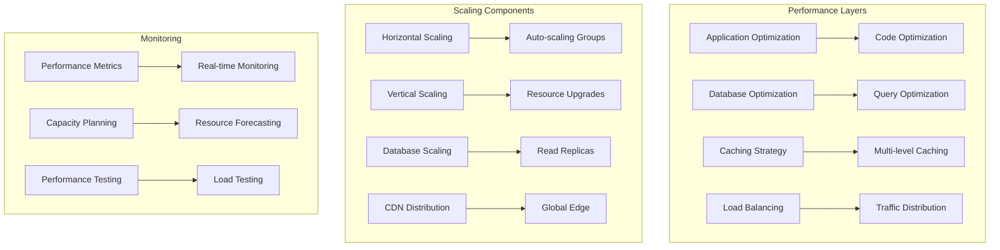

# 📈 Performance & Scaling

This document provides comprehensive documentation for performance optimization, scaling strategies, and capacity planning for Friendlines v2.0.

## 🎯 Performance Overview

Our performance strategy focuses on achieving sub-200ms response times, 99.9% uptime, and efficient resource utilization through optimization, caching, and intelligent scaling.

## 🏗️ Performance Architecture



## ⚡ Performance Optimization

### Application Performance

#### Code Optimization

```javascript
// Performance optimization utilities
class PerformanceOptimizer {
  // Request optimization
  static optimizeRequest(req, res, next) {
    // Add performance headers
    res.setHeader('X-Response-Time', '0ms');
    
    // Start timing
    const start = Date.now();
    
    res.on('finish', () => {
      const duration = Date.now() - start;
      res.setHeader('X-Response-Time', `${duration}ms`);
      
      // Log slow requests
      if (duration > 1000) {
        logger.warn('Slow request detected', {
          method: req.method,
          url: req.url,
          duration: `${duration}ms`,
          userAgent: req.get('User-Agent')
        });
      }
    });
    
    next();
  }

  // Database query optimization
  static async optimizedQuery(query, params = []) {
    const start = Date.now();
    
    try {
      const result = await db.query(query, params);
      const duration = Date.now() - start;
      
      // Log slow queries
      if (duration > 100) {
        logger.warn('Slow query detected', {
          query: query.substring(0, 100) + '...',
          duration: `${duration}ms`,
          params: params
        });
      }
      
      return result;
    } catch (error) {
      logger.error('Query failed', {
        query: query.substring(0, 100) + '...',
        error: error.message,
        duration: Date.now() - start
      });
      throw error;
    }
  }

  // Memory optimization
  static optimizeMemory() {
    // Force garbage collection in development
    if (process.env.NODE_ENV === 'development') {
      if (global.gc) {
        global.gc();
      }
    }
    
    // Monitor memory usage
    const memUsage = process.memoryUsage();
    const heapUsedPercent = (memUsage.heapUsed / memUsage.heapTotal) * 100;
    
    if (heapUsedPercent > 80) {
      logger.warn('High memory usage detected', {
        heapUsed: `${Math.round(memUsage.heapUsed / 1024 / 1024)}MB`,
        heapTotal: `${Math.round(memUsage.heapTotal / 1024 / 1024)}MB`,
        usagePercent: `${Math.round(heapUsedPercent)}%`
      });
    }
  }
}

// Apply performance optimization middleware
app.use(PerformanceOptimizer.optimizeRequest);
```

#### Response Optimization

```javascript
// Response optimization middleware
const responseOptimizer = (req, res, next) => {
  // Enable compression
  res.setHeader('Content-Encoding', 'gzip');
  
  // Cache control
  if (req.method === 'GET') {
    res.setHeader('Cache-Control', 'public, max-age=300'); // 5 minutes
  }
  
  // ETag support
  res.setHeader('ETag', generateETag(req.url));
  
  // Conditional requests
  const ifNoneMatch = req.get('If-None-Match');
  if (ifNoneMatch && ifNoneMatch === generateETag(req.url)) {
    return res.status(304).send();
  }
  
  next();
};

// Generate ETag for caching
function generateETag(url) {
  return `"${Buffer.from(url).toString('base64').substring(0, 8)}"`;
}

// Apply response optimization
app.use(responseOptimizer);
```

### Database Performance

#### Query Optimization

```javascript
// Database performance utilities
class DatabaseOptimizer {
  // Index optimization
  static async createIndexes() {
    const indexes = [
      'CREATE INDEX IF NOT EXISTS idx_users_email ON users(email)',
      'CREATE INDEX IF NOT EXISTS idx_users_username ON users(username)',
      'CREATE INDEX IF NOT EXISTS idx_posts_user_id ON posts(userId)',
      'CREATE INDEX IF NOT EXISTS idx_posts_created_at ON posts(createdAt)',
      'CREATE INDEX IF NOT EXISTS idx_groups_owner_id ON groups(ownerId)',
      'CREATE INDEX IF NOT EXISTS idx_notifications_user_id ON notifications(userId)'
    ];
    
    for (const index of indexes) {
      try {
        await db.run(index);
        logger.info(`Created index: ${index}`);
      } catch (error) {
        logger.error(`Failed to create index: ${index}`, { error: error.message });
      }
    }
  }

  // Query optimization
  static async optimizedUserQuery(userId) {
    // Use prepared statements
    const query = `
      SELECT u.id, u.username, u.email, u.firstName, u.lastName, u.createdAt,
             COUNT(p.id) as postCount,
             COUNT(g.id) as groupCount
      FROM users u
      LEFT JOIN posts p ON u.id = p.userId
      LEFT JOIN groups g ON u.id = g.ownerId
      WHERE u.id = ?
      GROUP BY u.id
    `;
    
    return await PerformanceOptimizer.optimizedQuery(query, [userId]);
  }

  // Pagination optimization
  static async optimizedPagination(table, page = 1, limit = 20, filters = {}) {
    const offset = (page - 1) * limit;
    
    // Build dynamic query
    let query = `SELECT * FROM ${table}`;
    const params = [];
    
    if (Object.keys(filters).length > 0) {
      const whereClause = Object.keys(filters)
        .map(key => `${key} = ?`)
        .join(' AND ');
      query += ` WHERE ${whereClause}`;
      params.push(...Object.values(filters));
    }
    
    query += ` ORDER BY createdAt DESC LIMIT ? OFFSET ?`;
    params.push(limit, offset);
    
    return await PerformanceOptimizer.optimizedQuery(query, params);
  }

  // Connection pooling
  static async getConnection() {
    // Implement connection pooling for better performance
    // This is a simplified example
    return db;
  }
}
```

#### Database Monitoring

```javascript
// Database performance monitoring
class DatabaseMonitor {
  static async monitorPerformance() {
    const metrics = {
      timestamp: new Date().toISOString(),
      connections: await this.getConnectionCount(),
      slowQueries: await this.getSlowQueries(),
      queryPerformance: await this.getQueryPerformance(),
      indexUsage: await this.getIndexUsage()
    };
    
    // Log performance metrics
    logger.info('Database performance metrics', metrics);
    
    // Alert on performance issues
    if (metrics.slowQueries.length > 10) {
      await this.alertSlowQueries(metrics.slowQueries);
    }
    
    return metrics;
  }

  static async getSlowQueries() {
    // This would typically query database performance logs
    // For SQLite, we maintain our own slow query log
    return global.slowQueryLog || [];
  }

  static async getQueryPerformance() {
    return {
      averageQueryTime: global.avgQueryTime || 0,
      totalQueries: global.totalQueries || 0,
      failedQueries: global.failedQueries || 0
    };
  }
}
```

## 🚀 Caching Strategy

### Multi-Level Caching

```javascript
// Caching system
class CacheManager {
  constructor() {
    this.memoryCache = new Map();
    this.cacheStats = {
      hits: 0,
      misses: 0,
      sets: 0
    };
  }

  // Memory cache
  async get(key) {
    const item = this.memoryCache.get(key);
    
    if (item && item.expiresAt > Date.now()) {
      this.cacheStats.hits++;
      return item.value;
    }
    
    if (item) {
      this.memoryCache.delete(key);
    }
    
    this.cacheStats.misses++;
    return null;
  }

  async set(key, value, ttl = 300000) { // 5 minutes default
    const item = {
      value,
      expiresAt: Date.now() + ttl
    };
    
    this.memoryCache.set(key, item);
    this.cacheStats.sets++;
    
    // Cleanup expired items
    this.cleanup();
  }

  async delete(key) {
    this.memoryCache.delete(key);
  }

  cleanup() {
    const now = Date.now();
    for (const [key, item] of this.memoryCache.entries()) {
      if (item.expiresAt <= now) {
        this.memoryCache.delete(key);
      }
    }
  }

  getStats() {
    return {
      ...this.cacheStats,
      size: this.memoryCache.size,
      hitRate: this.cacheStats.hits / (this.cacheStats.hits + this.cacheStats.misses)
    };
  }
}

// Global cache instance
const cache = new CacheManager();

// Caching middleware
const cacheMiddleware = (ttl = 300000) => {
  return async (req, res, next) => {
    if (req.method !== 'GET') {
      return next();
    }
    
    const cacheKey = `cache:${req.originalUrl}`;
    const cachedResponse = await cache.get(cacheKey);
    
    if (cachedResponse) {
      return res.json(cachedResponse);
    }
    
    // Store original send method
    const originalSend = res.json;
    
    // Override send method to cache response
    res.json = function(data) {
      cache.set(cacheKey, data, ttl);
      return originalSend.call(this, data);
    };
    
    next();
  };
};

// Apply caching to routes
app.use('/api/posts', cacheMiddleware(60000)); // 1 minute
app.use('/api/groups', cacheMiddleware(300000)); // 5 minutes
app.use('/api/users', cacheMiddleware(180000)); // 3 minutes
```

### Cache Invalidation

```javascript
// Cache invalidation system
class CacheInvalidator {
  static async invalidateUserCache(userId) {
    const patterns = [
      `cache:/api/users/${userId}`,
      `cache:/api/users/${userId}/posts`,
      `cache:/api/users/${userId}/groups`
    ];
    
    for (const pattern of patterns) {
      await cache.delete(pattern);
    }
    
    logger.info(`Invalidated cache for user: ${userId}`);
  }

  static async invalidatePostCache(postId) {
    const patterns = [
      `cache:/api/posts/${postId}`,
      `cache:/api/posts`,
      `cache:/api/feed`
    ];
    
    for (const pattern of patterns) {
      await cache.delete(pattern);
    }
    
    logger.info(`Invalidated cache for post: ${postId}`);
  }

  static async invalidateGroupCache(groupId) {
    const patterns = [
      `cache:/api/groups/${groupId}`,
      `cache:/api/groups/${groupId}/posts`,
      `cache:/api/groups`
    ];
    
    for (const pattern of patterns) {
      await cache.delete(pattern);
    }
    
    logger.info(`Invalidated cache for group: ${groupId}`);
  }
}
```

## 📈 Scaling Strategies

### Horizontal Scaling

```javascript
// Auto-scaling configuration
const scalingConfig = {
  thresholds: {
    cpu: 70, // CPU usage percentage
    memory: 80, // Memory usage percentage
    responseTime: 500, // Response time in ms
    errorRate: 5 // Error rate percentage
  },
  scaling: {
    minInstances: 1,
    maxInstances: 10,
    scaleUpCooldown: 300000, // 5 minutes
    scaleDownCooldown: 600000 // 10 minutes
  }
};

// Auto-scaling manager
class AutoScalingManager {
  static async checkScalingNeeds() {
    const metrics = await this.getSystemMetrics();
    const scalingDecision = await this.evaluateScaling(metrics);
    
    if (scalingDecision.action !== 'none') {
      await this.executeScaling(scalingDecision);
    }
    
    return scalingDecision;
  }

  static async getSystemMetrics() {
    return {
      cpu: await this.getCPUUsage(),
      memory: await this.getMemoryUsage(),
      responseTime: await this.getAverageResponseTime(),
      errorRate: await this.getErrorRate(),
      activeConnections: await this.getActiveConnections()
    };
  }

  static async evaluateScaling(metrics) {
    const decision = {
      action: 'none',
      reason: '',
      targetInstances: 0
    };

    // Check if scaling up is needed
    if (metrics.cpu > scalingConfig.thresholds.cpu ||
        metrics.memory > scalingConfig.thresholds.memory ||
        metrics.responseTime > scalingConfig.thresholds.responseTime) {
      
      decision.action = 'scale_up';
      decision.reason = 'High resource usage detected';
      decision.targetInstances = Math.min(
        scalingConfig.scaling.maxInstances,
        await this.calculateOptimalInstances(metrics)
      );
    }
    
    // Check if scaling down is needed
    else if (metrics.cpu < 30 && metrics.memory < 50 && metrics.activeConnections < 10) {
      decision.action = 'scale_down';
      decision.reason = 'Low resource usage detected';
      decision.targetInstances = Math.max(
        scalingConfig.scaling.minInstances,
        await this.calculateOptimalInstances(metrics)
      );
    }

    return decision;
  }

  static async executeScaling(decision) {
    logger.info(`Executing scaling decision: ${decision.action}`, decision);
    
    switch (decision.action) {
      case 'scale_up':
        await this.scaleUp(decision.targetInstances);
        break;
      case 'scale_down':
        await this.scaleDown(decision.targetInstances);
        break;
    }
  }

  static async scaleUp(targetInstances) {
    // Platform-specific scaling implementation
    const platform = process.env.DEPLOYMENT_PLATFORM;
    
    switch (platform) {
      case 'railway':
        await this.scaleRailway(targetInstances);
        break;
      case 'render':
        await this.scaleRender(targetInstances);
        break;
      case 'aws':
        await this.scaleAWS(targetInstances);
        break;
      default:
        logger.warn(`Auto-scaling not supported for platform: ${platform}`);
    }
  }

  static async scaleDown(targetInstances) {
    // Similar implementation for scaling down
    await this.scaleUp(targetInstances); // Reuse scale up logic
  }
}

// Auto-scaling scheduler
cron.schedule('*/30 * * * * *', async () => { // Every 30 seconds
  try {
    await AutoScalingManager.checkScalingNeeds();
  } catch (error) {
    logger.error('Auto-scaling check failed', { error: error.message });
  }
});
```

### Load Balancing

```javascript
// Load balancer configuration
const loadBalancerConfig = {
  algorithm: 'round_robin', // round_robin, least_connections, ip_hash
  healthCheck: {
    interval: 30000, // 30 seconds
    timeout: 5000, // 5 seconds
    unhealthyThreshold: 3,
    healthyThreshold: 2
  },
  stickySessions: false,
  sessionTimeout: 3600000 // 1 hour
};

// Load balancer manager
class LoadBalancerManager {
  constructor() {
    this.instances = [];
    this.currentIndex = 0;
    this.healthChecks = new Map();
  }

  // Add instance to load balancer
  addInstance(instance) {
    this.instances.push({
      id: instance.id,
      url: instance.url,
      health: 'healthy',
      connections: 0,
      lastHealthCheck: Date.now()
    });
    
    logger.info(`Added instance to load balancer: ${instance.id}`);
  }

  // Remove instance from load balancer
  removeInstance(instanceId) {
    this.instances = this.instances.filter(instance => instance.id !== instanceId);
    logger.info(`Removed instance from load balancer: ${instanceId}`);
  }

  // Get next instance based on algorithm
  getNextInstance() {
    if (this.instances.length === 0) {
      throw new Error('No healthy instances available');
    }

    const healthyInstances = this.instances.filter(instance => instance.health === 'healthy');
    
    if (healthyInstances.length === 0) {
      throw new Error('No healthy instances available');
    }

    switch (loadBalancerConfig.algorithm) {
      case 'round_robin':
        return this.roundRobin(healthyInstances);
      case 'least_connections':
        return this.leastConnections(healthyInstances);
      case 'ip_hash':
        return this.ipHash(healthyInstances);
      default:
        return this.roundRobin(healthyInstances);
    }
  }

  // Round robin algorithm
  roundRobin(instances) {
    const instance = instances[this.currentIndex % instances.length];
    this.currentIndex = (this.currentIndex + 1) % instances.length;
    return instance;
  }

  // Least connections algorithm
  leastConnections(instances) {
    return instances.reduce((min, instance) => 
      instance.connections < min.connections ? instance : min
    );
  }

  // IP hash algorithm
  ipHash(instances, clientIP) {
    const hash = this.hashCode(clientIP);
    return instances[hash % instances.length];
  }

  // Simple hash function
  hashCode(str) {
    let hash = 0;
    for (let i = 0; i < str.length; i++) {
      const char = str.charCodeAt(i);
      hash = ((hash << 5) - hash) + char;
      hash = hash & hash; // Convert to 32-bit integer
    }
    return Math.abs(hash);
  }

  // Health check
  async performHealthCheck(instance) {
    try {
      const response = await fetch(`${instance.url}/health`, {
        timeout: loadBalancerConfig.healthCheck.timeout
      });
      
      const isHealthy = response.ok;
      instance.health = isHealthy ? 'healthy' : 'unhealthy';
      instance.lastHealthCheck = Date.now();
      
      if (!isHealthy) {
        logger.warn(`Instance health check failed: ${instance.id}`);
      }
      
    } catch (error) {
      instance.health = 'unhealthy';
      instance.lastHealthCheck = Date.now();
      logger.error(`Health check error for instance: ${instance.id}`, { error: error.message });
    }
  }

  // Start health check monitoring
  startHealthChecks() {
    setInterval(() => {
      this.instances.forEach(instance => {
        this.performHealthCheck(instance);
      });
    }, loadBalancerConfig.healthCheck.interval);
  }
}

// Global load balancer instance
const loadBalancer = new LoadBalancerManager();
loadBalancer.startHealthChecks();
```

## 📊 Performance Monitoring

### Performance Metrics

```javascript
// Performance monitoring system
class PerformanceMonitor {
  constructor() {
    this.metrics = {
      responseTimes: [],
      throughput: [],
      errorRates: [],
      resourceUsage: []
    };
    this.alerts = [];
  }

  // Record response time
  recordResponseTime(duration) {
    this.metrics.responseTimes.push({
      timestamp: Date.now(),
      duration
    });
    
    // Keep only last 1000 measurements
    if (this.metrics.responseTimes.length > 1000) {
      this.metrics.responseTimes.shift();
    }
  }

  // Record throughput
  recordThroughput(requestsPerSecond) {
    this.metrics.throughput.push({
      timestamp: Date.now(),
      requestsPerSecond
    });
    
    if (this.metrics.throughput.length > 100) {
      this.metrics.throughput.shift();
    }
  }

  // Record error rate
  recordErrorRate(errorRate) {
    this.metrics.errorRates.push({
      timestamp: Date.now(),
      errorRate
    });
    
    if (this.metrics.errorRates.length > 100) {
      this.metrics.errorRates.shift();
    }
  }

  // Get performance statistics
  getStatistics() {
    const responseTimes = this.metrics.responseTimes.map(m => m.duration);
    const throughput = this.metrics.throughput.map(m => m.requestsPerSecond);
    const errorRates = this.metrics.errorRates.map(m => m.errorRate);

    return {
      responseTime: {
        average: this.average(responseTimes),
        median: this.median(responseTimes),
        p95: this.percentile(responseTimes, 95),
        p99: this.percentile(responseTimes, 99)
      },
      throughput: {
        average: this.average(throughput),
        peak: Math.max(...throughput, 0)
      },
      errorRate: {
        average: this.average(errorRates),
        current: errorRates[errorRates.length - 1] || 0
      }
    };
  }

  // Utility functions
  average(array) {
    return array.length > 0 ? array.reduce((a, b) => a + b, 0) / array.length : 0;
  }

  median(array) {
    if (array.length === 0) return 0;
    const sorted = array.slice().sort((a, b) => a - b);
    const mid = Math.floor(sorted.length / 2);
    return sorted.length % 2 === 0 ? (sorted[mid - 1] + sorted[mid]) / 2 : sorted[mid];
  }

  percentile(array, p) {
    if (array.length === 0) return 0;
    const sorted = array.slice().sort((a, b) => a - b);
    const index = Math.ceil((p / 100) * sorted.length) - 1;
    return sorted[index];
  }

  // Check performance alerts
  checkAlerts() {
    const stats = this.getStatistics();
    const alerts = [];

    // Response time alert
    if (stats.responseTime.p95 > 500) {
      alerts.push({
        type: 'response_time',
        severity: 'warning',
        message: `95th percentile response time is ${Math.round(stats.responseTime.p95)}ms`,
        value: stats.responseTime.p95,
        threshold: 500
      });
    }

    // Error rate alert
    if (stats.errorRate.average > 5) {
      alerts.push({
        type: 'error_rate',
        severity: 'critical',
        message: `Error rate is ${stats.errorRate.average.toFixed(2)}%`,
        value: stats.errorRate.average,
        threshold: 5
      });
    }

    // Throughput alert
    if (stats.throughput.average > 1000) {
      alerts.push({
        type: 'high_throughput',
        severity: 'info',
        message: `High throughput detected: ${Math.round(stats.throughput.average)} req/s`,
        value: stats.throughput.average,
        threshold: 1000
      });
    }

    return alerts;
  }
}

// Global performance monitor
const performanceMonitor = new PerformanceMonitor();

// Performance monitoring middleware
const performanceMiddleware = (req, res, next) => {
  const start = Date.now();
  
  res.on('finish', () => {
    const duration = Date.now() - start;
    performanceMonitor.recordResponseTime(duration);
  });
  
  next();
};

// Apply performance monitoring
app.use(performanceMiddleware);
```

### Performance Dashboard

```javascript
// Performance dashboard endpoint
app.get('/api/admin/performance', authenticateToken, authorizeRole(['admin']), async (req, res) => {
  try {
    const performanceData = {
      timestamp: new Date().toISOString(),
      statistics: performanceMonitor.getStatistics(),
      alerts: performanceMonitor.checkAlerts(),
      cache: cache.getStats(),
      system: {
        memory: process.memoryUsage(),
        cpu: process.cpuUsage(),
        uptime: process.uptime()
      }
    };
    
    res.json({
      success: true,
      data: performanceData
    });
  } catch (error) {
    res.status(500).json({
      success: false,
      message: 'Failed to retrieve performance data',
      error: error.message
    });
  }
});
```

## 🔧 Capacity Planning

### Resource Forecasting

```javascript
// Capacity planning system
class CapacityPlanner {
  static async forecastCapacity(timeframe = '30d') {
    const historicalData = await this.getHistoricalData(timeframe);
    const trends = await this.analyzeTrends(historicalData);
    const forecast = await this.generateForecast(trends, timeframe);
    
    return {
      current: await this.getCurrentUsage(),
      trends,
      forecast,
      recommendations: await this.generateRecommendations(forecast)
    };
  }

  static async getHistoricalData(timeframe) {
    // Get historical performance data
    const endDate = new Date();
    const startDate = new Date();
    startDate.setDate(startDate.getDate() - parseInt(timeframe));
    
    return {
      responseTimes: await this.getResponseTimeHistory(startDate, endDate),
      throughput: await this.getThroughputHistory(startDate, endDate),
      resourceUsage: await this.getResourceUsageHistory(startDate, endDate)
    };
  }

  static async analyzeTrends(data) {
    return {
      responseTimeTrend: this.calculateTrend(data.responseTimes),
      throughputTrend: this.calculateTrend(data.throughput),
      resourceTrend: this.calculateTrend(data.resourceUsage)
    };
  }

  static calculateTrend(data) {
    if (data.length < 2) return { slope: 0, direction: 'stable' };
    
    const x = Array.from({ length: data.length }, (_, i) => i);
    const y = data.map(d => d.value);
    
    const n = x.length;
    const sumX = x.reduce((a, b) => a + b, 0);
    const sumY = y.reduce((a, b) => a + b, 0);
    const sumXY = x.reduce((a, b, i) => a + x[i] * y[i], 0);
    const sumXX = x.reduce((a, b) => a + b * b, 0);
    
    const slope = (n * sumXY - sumX * sumY) / (n * sumXX - sumX * sumX);
    
    return {
      slope,
      direction: slope > 0.1 ? 'increasing' : slope < -0.1 ? 'decreasing' : 'stable'
    };
  }

  static async generateForecast(trends, timeframe) {
    const days = parseInt(timeframe);
    const forecast = {
      responseTime: this.forecastValue(trends.responseTimeTrend, days),
      throughput: this.forecastValue(trends.throughputTrend, days),
      resourceUsage: this.forecastValue(trends.resourceTrend, days)
    };
    
    return forecast;
  }

  static forecastValue(trend, days) {
    const currentValue = trend.current || 0;
    const projectedChange = trend.slope * days;
    return Math.max(0, currentValue + projectedChange);
  }

  static async generateRecommendations(forecast) {
    const recommendations = [];
    
    // Response time recommendations
    if (forecast.responseTime > 300) {
      recommendations.push({
        type: 'performance',
        priority: 'high',
        action: 'Scale up application instances',
        reason: 'Projected response time exceeds acceptable threshold'
      });
    }
    
    // Throughput recommendations
    if (forecast.throughput > 800) {
      recommendations.push({
        type: 'capacity',
        priority: 'medium',
        action: 'Add load balancer instances',
        reason: 'Projected throughput approaching capacity limits'
      });
    }
    
    // Resource recommendations
    if (forecast.resourceUsage > 80) {
      recommendations.push({
        type: 'infrastructure',
        priority: 'high',
        action: 'Upgrade server resources',
        reason: 'Projected resource usage approaching limits'
      });
    }
    
    return recommendations;
  }
}
```

---

## 🔗 Related Documentation

- [Architecture Overview](./architecture-overview.md)
- [Infrastructure as Code](./infrastructure-as-code.md)
- [Monitoring & Observability](./monitoring-observability.md)
- [Deployment Platforms](./deployment-platforms.md)

---

**Last Updated**: December 2024  
**Version**: 2.0.0  
**Maintainer**: DevOps Team 