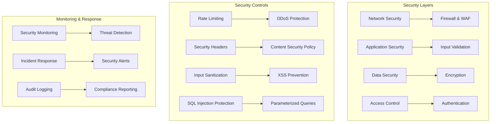
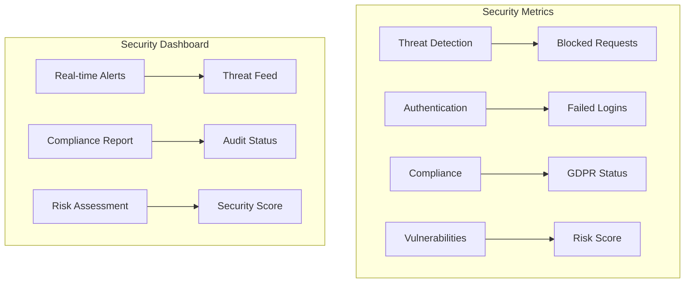

# 🔐 Security & Compliance

This document provides comprehensive documentation for the security measures, compliance requirements, and best practices implemented in Friendlines v2.0.

## 🎯 Security Overview

Our security strategy follows a defense-in-depth approach, implementing multiple layers of security controls to protect the application, data, and infrastructure from various threats.

## 🏗️ Security Architecture



## 🔒 Security Measures

### 1. Network Security

#### Firewall Configuration

```javascript
// Security middleware configuration
const helmet = require('helmet');
const rateLimit = require('express-rate-limit');

// Security headers
app.use(helmet({
  contentSecurityPolicy: {
    directives: {
      defaultSrc: ["'self'"],
      styleSrc: ["'self'", "'unsafe-inline'"],
      scriptSrc: ["'self'"],
      imgSrc: ["'self'", "data:", "https:"],
      connectSrc: ["'self'"],
      fontSrc: ["'self'"],
      objectSrc: ["'none'"],
      mediaSrc: ["'self'"],
      frameSrc: ["'none'"]
    }
  },
  hsts: {
    maxAge: 31536000,
    includeSubDomains: true,
    preload: true
  },
  noSniff: true,
  referrerPolicy: { policy: 'strict-origin-when-cross-origin' }
}));

// Rate limiting
const limiter = rateLimit({
  windowMs: 15 * 60 * 1000, // 15 minutes
  max: 100, // limit each IP to 100 requests per windowMs
  message: 'Too many requests from this IP, please try again later.',
  standardHeaders: true,
  legacyHeaders: false
});

// Apply rate limiting to all routes
app.use(limiter);

// Stricter rate limiting for auth routes
const authLimiter = rateLimit({
  windowMs: 15 * 60 * 1000, // 15 minutes
  max: 5, // limit each IP to 5 requests per windowMs
  message: 'Too many authentication attempts, please try again later.',
  standardHeaders: true,
  legacyHeaders: false
});

app.use('/api/auth', authLimiter);
```

#### CORS Configuration

```javascript
// CORS configuration
const cors = require('cors');

const corsOptions = {
  origin: function (origin, callback) {
    // Allow requests with no origin (mobile apps, etc.)
    if (!origin) return callback(null, true);
    
    const allowedOrigins = [
      'https://friendlines.app',
      'https://www.friendlines.app',
      'https://friendlines-frontend.vercel.app',
      'http://localhost:3000', // Development
      'http://localhost:19006' // Expo development
    ];
    
    if (allowedOrigins.indexOf(origin) !== -1) {
      callback(null, true);
    } else {
      callback(new Error('Not allowed by CORS'));
    }
  },
  credentials: true,
  methods: ['GET', 'POST', 'PUT', 'DELETE', 'OPTIONS'],
  allowedHeaders: ['Content-Type', 'Authorization', 'X-Requested-With'],
  maxAge: 86400 // 24 hours
};

app.use(cors(corsOptions));
```

### 2. Application Security

#### Input Validation

```javascript
// Input validation middleware
const { body, validationResult } = require('express-validator');

// Validation rules
const userValidationRules = [
  body('email').isEmail().normalizeEmail(),
  body('password').isLength({ min: 8 }).matches(/^(?=.*[a-z])(?=.*[A-Z])(?=.*\d)(?=.*[@$!%*?&])[A-Za-z\d@$!%*?&]/),
  body('username').isLength({ min: 3, max: 30 }).matches(/^[a-zA-Z0-9_]+$/),
  body('firstName').trim().isLength({ min: 1, max: 50 }),
  body('lastName').trim().isLength({ min: 1, max: 50 })
];

const postValidationRules = [
  body('title').trim().isLength({ min: 1, max: 200 }),
  body('content').trim().isLength({ min: 1, max: 5000 }),
  body('groupId').optional().isUUID(),
  body('tags').optional().isArray({ max: 10 })
];

// Validation middleware
const validate = (req, res, next) => {
  const errors = validationResult(req);
  if (!errors.isEmpty()) {
    return res.status(400).json({
      success: false,
      message: 'Validation failed',
      errors: errors.array()
    });
  }
  next();
};

// Apply validation to routes
app.post('/api/auth/register', userValidationRules, validate, authController.register);
app.post('/api/posts', postValidationRules, validate, postController.create);
```

#### SQL Injection Prevention

```javascript
// Database utilities with parameterized queries
const sqlite3 = require('sqlite3').verbose();

class DatabaseManager {
  constructor() {
    this.db = new sqlite3.Database('./data/friendlines.db');
  }

  // Safe query execution with parameters
  async query(sql, params = []) {
    return new Promise((resolve, reject) => {
      this.db.all(sql, params, (err, rows) => {
        if (err) {
          reject(err);
        } else {
          resolve(rows);
        }
      });
    });
  }

  // Safe single row query
  async get(sql, params = []) {
    return new Promise((resolve, reject) => {
      this.db.get(sql, params, (err, row) => {
        if (err) {
          reject(err);
        } else {
          resolve(row);
        }
      });
    });
  }

  // Safe insert/update/delete
  async run(sql, params = []) {
    return new Promise((resolve, reject) => {
      this.db.run(sql, params, function(err) {
        if (err) {
          reject(err);
        } else {
          resolve({ id: this.lastID, changes: this.changes });
        }
      });
    });
  }
}

// Example usage with parameterized queries
const db = new DatabaseManager();

// Safe user lookup
async function getUserById(userId) {
  return await db.get('SELECT * FROM users WHERE id = ?', [userId]);
}

// Safe user search
async function searchUsers(searchTerm) {
  return await db.query('SELECT * FROM users WHERE username LIKE ?', [`%${searchTerm}%`]);
}
```

#### XSS Prevention

```javascript
// XSS prevention utilities
const xss = require('xss');

// Sanitize user input
function sanitizeInput(input) {
  if (typeof input === 'string') {
    return xss(input, {
      whiteList: {}, // No HTML allowed
      stripIgnoreTag: true,
      stripIgnoreTagBody: ['script']
    });
  }
  return input;
}

// Sanitize object recursively
function sanitizeObject(obj) {
  if (typeof obj !== 'object' || obj === null) {
    return sanitizeInput(obj);
  }
  
  if (Array.isArray(obj)) {
    return obj.map(item => sanitizeObject(item));
  }
  
  const sanitized = {};
  for (const [key, value] of Object.entries(obj)) {
    sanitized[key] = sanitizeObject(value);
  }
  return sanitized;
}

// Middleware to sanitize request body
const sanitizeBody = (req, res, next) => {
  if (req.body) {
    req.body = sanitizeObject(req.body);
  }
  next();
};

// Apply sanitization to routes
app.use('/api', sanitizeBody);
```

### 3. Authentication & Authorization

#### JWT Implementation

```javascript
// JWT configuration
const jwt = require('jsonwebtoken');
const bcrypt = require('bcrypt');

const JWT_SECRET = process.env.JWT_SECRET || 'your-secret-key';
const JWT_EXPIRES_IN = '24h';

// Generate JWT token
function generateToken(user) {
  return jwt.sign(
    {
      id: user.id,
      email: user.email,
      username: user.username,
      role: user.role
    },
    JWT_SECRET,
    { expiresIn: JWT_EXPIRES_IN }
  );
}

// Verify JWT token
function verifyToken(token) {
  try {
    return jwt.verify(token, JWT_SECRET);
  } catch (error) {
    throw new Error('Invalid token');
  }
}

// Authentication middleware
const authenticateToken = (req, res, next) => {
  const authHeader = req.headers['authorization'];
  const token = authHeader && authHeader.split(' ')[1];

  if (!token) {
    return res.status(401).json({
      success: false,
      message: 'Access token required'
    });
  }

  try {
    const decoded = verifyToken(token);
    req.user = decoded;
    next();
  } catch (error) {
    return res.status(403).json({
      success: false,
      message: 'Invalid or expired token'
    });
  }
};

// Role-based authorization
const authorizeRole = (roles) => {
  return (req, res, next) => {
    if (!req.user) {
      return res.status(401).json({
        success: false,
        message: 'Authentication required'
      });
    }

    if (!roles.includes(req.user.role)) {
      return res.status(403).json({
        success: false,
        message: 'Insufficient permissions'
      });
    }

    next();
  };
};

// Apply authentication to protected routes
app.use('/api/users', authenticateToken);
app.use('/api/posts', authenticateToken);
app.use('/api/groups', authenticateToken);

// Apply role-based authorization
app.delete('/api/users/:id', authenticateToken, authorizeRole(['admin']), userController.delete);
```

#### Password Security

```javascript
// Password hashing and verification
const SALT_ROUNDS = 12;

// Hash password
async function hashPassword(password) {
  return await bcrypt.hash(password, SALT_ROUNDS);
}

// Verify password
async function verifyPassword(password, hash) {
  return await bcrypt.compare(password, hash);
}

// Password strength validation
function validatePasswordStrength(password) {
  const minLength = 8;
  const hasUpperCase = /[A-Z]/.test(password);
  const hasLowerCase = /[a-z]/.test(password);
  const hasNumbers = /\d/.test(password);
  const hasSpecialChar = /[@$!%*?&]/.test(password);

  const errors = [];
  
  if (password.length < minLength) {
    errors.push(`Password must be at least ${minLength} characters long`);
  }
  if (!hasUpperCase) {
    errors.push('Password must contain at least one uppercase letter');
  }
  if (!hasLowerCase) {
    errors.push('Password must contain at least one lowercase letter');
  }
  if (!hasNumbers) {
    errors.push('Password must contain at least one number');
  }
  if (!hasSpecialChar) {
    errors.push('Password must contain at least one special character (@$!%*?&)');
  }

  return {
    isValid: errors.length === 0,
    errors
  };
}
```

### 4. Data Security

#### Data Encryption

```javascript
// Encryption utilities
const crypto = require('crypto');

const ENCRYPTION_KEY = process.env.ENCRYPTION_KEY || 'your-32-character-secret-key-here';
const ALGORITHM = 'aes-256-cbc';

// Encrypt sensitive data
function encrypt(text) {
  const iv = crypto.randomBytes(16);
  const cipher = crypto.createCipher(ALGORITHM, ENCRYPTION_KEY);
  let encrypted = cipher.update(text, 'utf8', 'hex');
  encrypted += cipher.final('hex');
  return iv.toString('hex') + ':' + encrypted;
}

// Decrypt sensitive data
function decrypt(text) {
  const textParts = text.split(':');
  const iv = Buffer.from(textParts.shift(), 'hex');
  const encryptedText = textParts.join(':');
  const decipher = crypto.createDecipher(ALGORITHM, ENCRYPTION_KEY);
  let decrypted = decipher.update(encryptedText, 'hex', 'utf8');
  decrypted += decipher.final('utf8');
  return decrypted;
}

// Secure data storage
class SecureStorage {
  static encryptSensitiveData(data) {
    const sensitiveFields = ['email', 'phone', 'address'];
    const encrypted = { ...data };
    
    for (const field of sensitiveFields) {
      if (encrypted[field]) {
        encrypted[field] = encrypt(encrypted[field]);
      }
    }
    
    return encrypted;
  }

  static decryptSensitiveData(data) {
    const sensitiveFields = ['email', 'phone', 'address'];
    const decrypted = { ...data };
    
    for (const field of sensitiveFields) {
      if (decrypted[field]) {
        try {
          decrypted[field] = decrypt(decrypted[field]);
        } catch (error) {
          // Field might not be encrypted
        }
      }
    }
    
    return decrypted;
  }
}
```

#### Secure File Upload

```javascript
// File upload security
const multer = require('multer');
const path = require('path');

// File type validation
const allowedFileTypes = ['image/jpeg', 'image/png', 'image/gif', 'image/webp'];
const maxFileSize = 5 * 1024 * 1024; // 5MB

// File filter function
const fileFilter = (req, file, cb) => {
  // Check file type
  if (!allowedFileTypes.includes(file.mimetype)) {
    return cb(new Error('Invalid file type. Only JPEG, PNG, GIF, and WebP are allowed.'), false);
  }
  
  // Check file size
  if (file.size > maxFileSize) {
    return cb(new Error('File too large. Maximum size is 5MB.'), false);
  }
  
  cb(null, true);
};

// Secure storage configuration
const storage = multer.diskStorage({
  destination: (req, file, cb) => {
    cb(null, 'uploads/');
  },
  filename: (req, file, cb) => {
    // Generate secure filename
    const uniqueSuffix = Date.now() + '-' + Math.round(Math.random() * 1E9);
    const ext = path.extname(file.originalname);
    cb(null, file.fieldname + '-' + uniqueSuffix + ext);
  }
});

// Configure multer with security settings
const upload = multer({
  storage: storage,
  fileFilter: fileFilter,
  limits: {
    fileSize: maxFileSize,
    files: 1 // Only allow one file per request
  }
});

// Virus scanning (example with ClamAV)
const scanFile = async (filePath) => {
  // Implement virus scanning logic here
  // This is a placeholder for actual virus scanning implementation
  return { isClean: true };
};

// Secure upload endpoint
app.post('/api/upload', authenticateToken, upload.single('file'), async (req, res) => {
  try {
    if (!req.file) {
      return res.status(400).json({
        success: false,
        message: 'No file uploaded'
      });
    }

    // Scan file for viruses
    const scanResult = await scanFile(req.file.path);
    if (!scanResult.isClean) {
      // Remove infected file
      fs.unlinkSync(req.file.path);
      return res.status(400).json({
        success: false,
        message: 'File appears to be infected'
      });
    }

    res.json({
      success: true,
      message: 'File uploaded successfully',
      data: {
        filename: req.file.filename,
        originalName: req.file.originalname,
        size: req.file.size,
        mimetype: req.file.mimetype
      }
    });
  } catch (error) {
    res.status(500).json({
      success: false,
      message: 'File upload failed',
      error: error.message
    });
  }
});
```

## 📋 Compliance Requirements

### GDPR Compliance

#### Data Protection Measures

```javascript
// GDPR compliance utilities
class GDPRCompliance {
  // Data minimization
  static minimizeData(userData) {
    const requiredFields = ['id', 'username', 'email'];
    const minimized = {};
    
    for (const field of requiredFields) {
      if (userData[field]) {
        minimized[field] = userData[field];
      }
    }
    
    return minimized;
  }

  // Right to be forgotten
  static async deleteUserData(userId) {
    try {
      // Delete user account
      await deleteUser(userId);
      
      // Delete user posts
      await deleteUserPosts(userId);
      
      // Delete user comments
      await deleteUserComments(userId);
      
      // Log deletion for audit
      await logDataDeletion(userId, 'user_requested');
      
      return true;
    } catch (error) {
      throw new Error('Failed to delete user data');
    }
  }

  // Data portability
  static async exportUserData(userId) {
    try {
      const userData = await getUserData(userId);
      const posts = await getUserPosts(userId);
      const comments = await getUserComments(userId);
      
      return {
        user: userData,
        posts: posts,
        comments: comments,
        exportedAt: new Date().toISOString()
      };
    } catch (error) {
      throw new Error('Failed to export user data');
    }
  }

  // Consent management
  static async updateConsent(userId, consentData) {
    try {
      await updateUserConsent(userId, consentData);
      await logConsentUpdate(userId, consentData);
      return true;
    } catch (error) {
      throw new Error('Failed to update consent');
    }
  }
}

// GDPR endpoints
app.delete('/api/users/:id/data', authenticateToken, async (req, res) => {
  try {
    if (req.user.id !== req.params.id && req.user.role !== 'admin') {
      return res.status(403).json({
        success: false,
        message: 'Unauthorized'
      });
    }

    await GDPRCompliance.deleteUserData(req.params.id);
    
    res.json({
      success: true,
      message: 'User data deleted successfully'
    });
  } catch (error) {
    res.status(500).json({
      success: false,
      message: 'Failed to delete user data',
      error: error.message
    });
  }
});

app.get('/api/users/:id/data-export', authenticateToken, async (req, res) => {
  try {
    if (req.user.id !== req.params.id && req.user.role !== 'admin') {
      return res.status(403).json({
        success: false,
        message: 'Unauthorized'
      });
    }

    const userData = await GDPRCompliance.exportUserData(req.params.id);
    
    res.json({
      success: true,
      data: userData
    });
  } catch (error) {
    res.status(500).json({
      success: false,
      message: 'Failed to export user data',
      error: error.message
    });
  }
});
```

### Security Headers

```javascript
// Security headers configuration
app.use(helmet({
  contentSecurityPolicy: {
    directives: {
      defaultSrc: ["'self'"],
      styleSrc: ["'self'", "'unsafe-inline'"],
      scriptSrc: ["'self'"],
      imgSrc: ["'self'", "data:", "https:"],
      connectSrc: ["'self'"],
      fontSrc: ["'self'"],
      objectSrc: ["'none'"],
      mediaSrc: ["'self'"],
      frameSrc: ["'none'"]
    }
  },
  hsts: {
    maxAge: 31536000,
    includeSubDomains: true,
    preload: true
  },
  noSniff: true,
  referrerPolicy: { policy: 'strict-origin-when-cross-origin' },
  frameguard: { action: 'deny' },
  xssFilter: true,
  hidePoweredBy: true
}));

// Additional security headers
app.use((req, res, next) => {
  res.setHeader('X-Content-Type-Options', 'nosniff');
  res.setHeader('X-Frame-Options', 'DENY');
  res.setHeader('X-XSS-Protection', '1; mode=block');
  res.setHeader('Strict-Transport-Security', 'max-age=31536000; includeSubDomains; preload');
  res.setHeader('Referrer-Policy', 'strict-origin-when-cross-origin');
  res.setHeader('Permissions-Policy', 'geolocation=(), microphone=(), camera=()');
  next();
});
```

## 🔍 Security Monitoring

### Security Event Logging

```javascript
// Security event logging
class SecurityLogger {
  static logSecurityEvent(event) {
    const securityEvent = {
      timestamp: new Date().toISOString(),
      eventType: event.type,
      severity: event.severity,
      userId: event.userId,
      ipAddress: event.ipAddress,
      userAgent: event.userAgent,
      details: event.details,
      action: event.action
    };

    // Log to security log file
    logger.error('Security Event', securityEvent);
    
    // Send to security monitoring system
    this.sendToSecurityMonitoring(securityEvent);
  }

  static logFailedLogin(ipAddress, userAgent, username) {
    this.logSecurityEvent({
      type: 'failed_login',
      severity: 'medium',
      userId: null,
      ipAddress,
      userAgent,
      details: { username },
      action: 'block_ip_if_threshold_exceeded'
    });
  }

  static logSuspiciousActivity(userId, ipAddress, userAgent, activity) {
    this.logSecurityEvent({
      type: 'suspicious_activity',
      severity: 'high',
      userId,
      ipAddress,
      userAgent,
      details: { activity },
      action: 'investigate_and_alert'
    });
  }

  static logDataBreach(userId, ipAddress, userAgent, dataType) {
    this.logSecurityEvent({
      type: 'data_breach',
      severity: 'critical',
      userId,
      ipAddress,
      userAgent,
      details: { dataType },
      action: 'immediate_response_required'
    });
  }
}

// Security monitoring middleware
const securityMonitoring = (req, res, next) => {
  // Track failed login attempts
  const failedLoginKey = `failed_login:${req.ip}`;
  const failedLoginCount = req.session[failedLoginKey] || 0;
  
  if (failedLoginCount > 5) {
    SecurityLogger.logSecurityEvent({
      type: 'ip_blocked',
      severity: 'high',
      userId: null,
      ipAddress: req.ip,
      userAgent: req.get('User-Agent'),
      details: { failedLoginCount },
      action: 'block_ip'
    });
    
    return res.status(429).json({
      success: false,
      message: 'Too many failed login attempts. Please try again later.'
    });
  }
  
  next();
};
```

### Threat Detection

```javascript
// Threat detection system
class ThreatDetection {
  static patterns = {
    sqlInjection: /(\b(union|select|insert|update|delete|drop|create|alter)\b)/i,
    xss: /(<script|javascript:|on\w+\s*=)/i,
    pathTraversal: /(\.\.\/|\.\.\\)/,
    commandInjection: /(\b(cmd|exec|system|eval)\b)/i
  };

  static detectThreats(req) {
    const threats = [];
    
    // Check request body
    if (req.body) {
      const bodyString = JSON.stringify(req.body);
      for (const [threatType, pattern] of Object.entries(this.patterns)) {
        if (pattern.test(bodyString)) {
          threats.push({
            type: threatType,
            source: 'request_body',
            pattern: pattern.source
          });
        }
      }
    }
    
    // Check query parameters
    if (req.query) {
      const queryString = JSON.stringify(req.query);
      for (const [threatType, pattern] of Object.entries(this.patterns)) {
        if (pattern.test(queryString)) {
          threats.push({
            type: threatType,
            source: 'query_parameters',
            pattern: pattern.source
          });
        }
      }
    }
    
    return threats;
  }

  static handleThreats(threats, req, res) {
    if (threats.length > 0) {
      // Log security threat
      SecurityLogger.logSecurityEvent({
        type: 'security_threat',
        severity: 'high',
        userId: req.user?.id,
        ipAddress: req.ip,
        userAgent: req.get('User-Agent'),
        details: { threats },
        action: 'block_request'
      });
      
      // Block request
      return res.status(403).json({
        success: false,
        message: 'Request blocked due to security concerns'
      });
    }
  }
}

// Apply threat detection middleware
app.use((req, res, next) => {
  const threats = ThreatDetection.detectThreats(req);
  const threatResponse = ThreatDetection.handleThreats(threats, req, res);
  
  if (threatResponse) {
    return threatResponse;
  }
  
  next();
});
```

## 📊 Security Metrics

### Security Dashboard

```javascript
// Security metrics endpoint
app.get('/api/security/metrics', authenticateToken, authorizeRole(['admin']), async (req, res) => {
  try {
    const securityMetrics = {
      timestamp: new Date().toISOString(),
      threats: {
        blockedRequests: await getBlockedRequestsCount(),
        failedLogins: await getFailedLoginsCount(),
        suspiciousActivities: await getSuspiciousActivitiesCount()
      },
      vulnerabilities: {
        openIssues: await getOpenSecurityIssues(),
        patchedIssues: await getPatchedSecurityIssues(),
        riskScore: await calculateRiskScore()
      },
      compliance: {
        gdprCompliance: await checkGDPRCompliance(),
        securityAudit: await getSecurityAuditStatus(),
        dataProtection: await checkDataProtectionStatus()
      }
    };
    
    res.json({
      success: true,
      data: securityMetrics
    });
  } catch (error) {
    res.status(500).json({
      success: false,
      message: 'Failed to retrieve security metrics',
      error: error.message
    });
  }
});
```

### Security Metrics Visualization



## 🔄 Security Incident Response

### Incident Response Plan

```javascript
// Incident response system
class IncidentResponse {
  static async handleSecurityIncident(incident) {
    const response = {
      incidentId: this.generateIncidentId(),
      timestamp: new Date().toISOString(),
      severity: incident.severity,
      status: 'investigating',
      actions: []
    };

    // Immediate response based on severity
    switch (incident.severity) {
      case 'critical':
        await this.handleCriticalIncident(incident, response);
        break;
      case 'high':
        await this.handleHighSeverityIncident(incident, response);
        break;
      case 'medium':
        await this.handleMediumSeverityIncident(incident, response);
        break;
      case 'low':
        await this.handleLowSeverityIncident(incident, response);
        break;
    }

    // Log incident
    await this.logIncident(response);
    
    // Notify security team
    await this.notifySecurityTeam(response);
    
    return response;
  }

  static async handleCriticalIncident(incident, response) {
    // Immediate actions for critical incidents
    response.actions.push('Immediate system lockdown');
    response.actions.push('Disable affected user accounts');
    response.actions.push('Initiate emergency response protocol');
    
    // Block suspicious IPs
    await this.blockIP(incident.ipAddress);
    
    // Notify stakeholders
    await this.notifyStakeholders(incident);
  }

  static generateIncidentId() {
    return 'INC-' + Date.now() + '-' + Math.random().toString(36).substr(2, 9);
  }
}
```

---

## 🔗 Related Documentation

- [Architecture Overview](./architecture-overview.md)
- [Infrastructure as Code](./infrastructure-as-code.md)
- [Monitoring & Observability](./monitoring-observability.md)
- [Disaster Recovery](./disaster-recovery.md)

---

**Last Updated**: December 2024  
**Version**: 2.0.0  
**Maintainer**: Security Team 